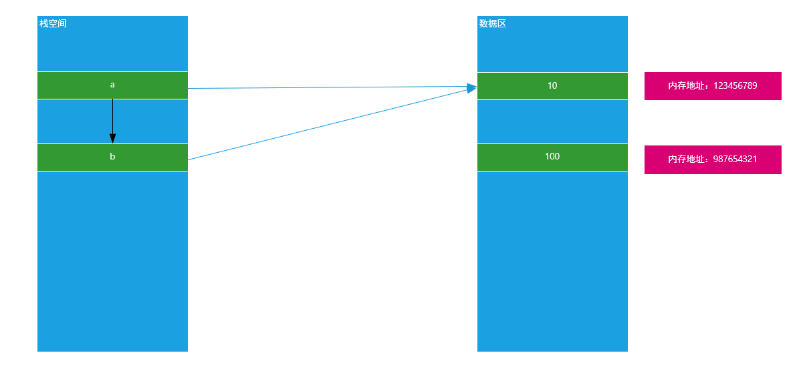
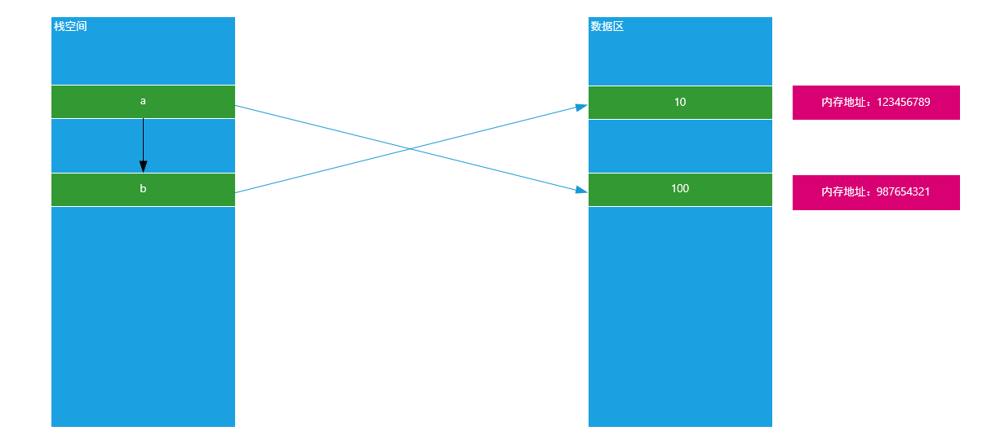
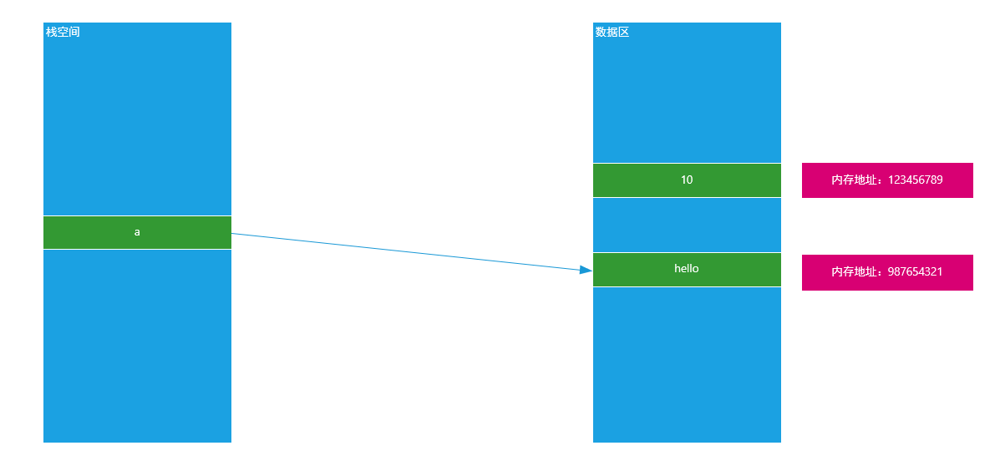
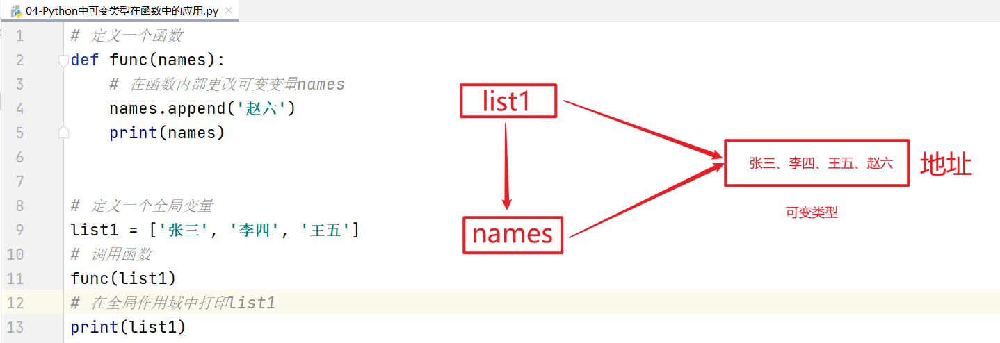

# Python函数进阶与文件操作

# 一、作业回顾

## 1、格式化输出与%百分号

以下结果中，可以正常输出“50%及格”语句是（B）

A、print("%d\%及格" % (50))    =>  回答大部分结果（Python这种写法不正确）

B、print("%d%%及格" % (50))  =>  正确结果

## 2、字符串切片

定义一个字符串str1 = 'abcdefg'，使用切片截取字符串str1[3::-2]，求返回结果：（C）

C、'db'

## 3、字典的定义

其实字典中的key可以是很多数据类型（不可变数据类型 => 整型、浮点型、字符串、元组）

```python
my_dict = {}
my_dict[1] = 1
my_dict['1'] = 2
my_dict[1.0] = 3
print(my_dict[1] + my_dict['1'] + my_dict[1.0])
```

# 二、引用变量与可变、非可变类型

## 1、引用变量

在大多数编程语言中，值的传递通常可以分为两种形式“值传递与引用传递”，但是在Python中变量的传递基本上都是引用传递。

### ☆ 聊聊变量在内存底层的存储形式

```python
a = 10
```

第一步：首先在计算机内存中创建一个数值10（占用一块内存空间）

第二步：在栈空间中声明一个变量，如a

第三步：把数值10的内存地址赋予给变量小a，形成所谓的==“引用关系”==


### ☆ 如何验证Python中变量的引用关系

答：可以使用内置方法id()，其参数就是要显示的变量信息 => `id(变量名称)`

```python
a = 10
print(id(a))
```

### ☆ 把一个变量赋予给另外一个变量的影响

```python
a = 10
b = a
print(id(a))
print(id(b))
```

运行结果：


说明：由以上运行结果可知，当我们把一个变量赋予给另外一个变量时，其两者指向的内存地址相同。就说明a和b指向了同一块内存空间，原理图如下：



思考：如果在b = a以后，我们改变了变量a的值，问变量b是否会受到影响？

```python
# a = 10
# print(id(a))

a = 10
b = a

a = 100
print(b)  # 10 或 100

print(id(a))
print(id(b))
```

原理图：



总结：不可变数据类型（数值）在赋值以后，其中一个值的改变不影响另外一个变量，因为两者指向空间地址不同。

## 2、Python中可变和非可变数据类型

### ☆ 问题1：在Python中一共有几种数据类型？

答：7种，数值（int整型、float浮点类型）、bool类型（True和False）、字符串类型（str）、元组（tuple 1,2,3）、列表（list [1, 2, 3]）、字典（dict {key:value})、集合（set {1, 2})

在Python中，我们可以把7种数据类型分为两大类：可变类型 + 非可变类型

① 非可变类型

数值（int整型、float浮点类型）

bool类型（True和False）

字符串类型（str）

元组（tuple 1,2,3）


② 可变类型

列表（list [1, 2, 3]）

字典（dict {key:value})

集合（set {1, 2})

### ☆ 问题2：如何判断一个数据类型是可变类型还是非可变类型？

在Python中，可变类型与非可变类型主要是通过这个数据类型在内存中的表现形式来进行定义的。

==① 可变类型就是在内存中，其内存地址一旦固定，其值是可以发生改变的==

```python
a = [1, 2, 3]
print(id(a))

# 向内存中追加新数据（对数据进行改变只能通过数据类型.方法()实现）
a.append(4)
print(id(a))
```

原理图：


==② 非可变类型就是在内存中，内存地址一旦固定，其值就没办法发生任何改变了==

```python
a = 10
print(id(a))

a = 'hello'
print(id(a))
```

原理图：



## 3、可变类型与非可变类型在函数中的应用

### ☆ 可变类型

```python
# 定义一个函数
def func(names):
    print(names)
    
# 定义一个全局变量
names = ['张三', '李四', '王五']
# 调用函数
func(names)
```

原理图：



综上所述：可变类型在函数中，如果在全局或局部中对可变类型进行增删改操作，其外部和内部都会受到影响。

### ☆ 不可变类型

```python
# 定义一个函数
def func(num):
    num += 1
    print(num)
    
# 定义一个全局变量
a = 10
# 调用函数
func(a)
# 在全局作用域中打印a
print(a)
```


综上所述：不可变类型在函数中，局部或全局的改变对外部和内部都没有任何影响。

# 三、函数递归（重点难点）

## 1、前言

编程思想：如何利用数学模型，来解决对应的需求问题；然后利用代码实现对应的数据模

算法：使用代码实现对应的数学模型，从而解决对应的业务问题

> 程序 = 算法 + 数据结构

在我们经常使用的算法中，有两种非常常用的算法：`递推算法 + 递归算法`，专门用于解决一些比较复杂，但是拆分后相似度又非常高的程序。

## 2、递推算法

递归算法：递推算法是一种简单的算法，即通过已知条件，利用特定条件得出中间推论，直至得到结果的算法。递推又分为顺推和逆推。

顺推：通过最简单的条件，然后逐步推演结果

逆推：通过结果找到规律，然后推导已知条件


递推算法案例：斐波那契数列

1   1    2    3    5    8    13    21   ...

① ② ③  ④  ⑤  ⑥ ...

第1位为1，第2位为1，第3位为2 = 1 + 1，第4位为3 = 2 + 1，依次类推...第n位结果为多少？

f(n) = f(n-1) + f(n-2)

提出问题：求斐波那契数列第15位的结果？

分析：f(15) = f(14) + f(13)  

​            f(14) = f(13) + f(12)

​	        f(13) = f(12) + f(11)

​            ...

​		    f(4)   =  f(3) + f(2)   = 3  +  1

​		    f(3)   =  f(2) + f(1)   = 2

​	        f(2)  =   1

​           f(1)   =   1

递推算法：使用while循环或for循环

```python
# 递推算法：根据已知条件，求结果（或者根据结果求未知条件）
def recusive(n):
    """ 返回斐波那契数列某一位（n>=1）的结果 """
    if n == 1 or n == 2:
        return 1
    # 开始递推f(3) = f(2) + f(1)  f(4) = f(3) + f(2) ... f(15) = f(14) + f(13)
    dict1 = {1:1, 2:1}
    for i in range(3, n+1):
        # f(3) = f(2) + f(1)
        # f(i) = f(i-1) + f(i-2)
        dict1[i] = dict1[i-1] + dict1[i-2]
    return dict1[n]

# 函数调用
print(recusive(15))
```

## 3、什么是递归算法

程序调用自身的编程技巧称为递归（ recursion）。递归做为一种算法在程序设计语言中广泛应用，它通常==把一个大型复杂的问题层层转化为一个与原问题相似的规模较小的问题来求解==，递归策略只需少量的程序就可描述出解题过程所需要的多次重复计算，大大地减少了程序的代码量。

① 简化问题：找到最优子问题（不能再小） ② 函数自己调用自己

```python
def func():
    # 自己调用自己
    func()
    
func()
```

## 4、递归两种重要的元素

递归有两个非常重要的概念：

==① 递归点==：找到解决当前问题的等价函数（先解决规模比当前问题小一些的函数，依次类推，最终实现对问题的解决） => 有递有归

==② 递归出口==：当问题解决的时候，已经到达（必须存在）最优问题，不能再次调用函数了

> 注：如果一个递归函数没有递归出口就变成了死循环

## 5、编写递归三步走

==① 明确你这个函数想要干什么==

如：求斐波那契数列

==② 寻找递归结束条件==

如：就是在什么情况下，递归会停止循环，返回结果

==③ 找出函数的等价关系式==

如：斐波那契数列，第n位 f(n) = f(n-1) + f(n-2)


案例1：使用递归求斐波那契数列

第一步：明确这个函数想要干什么（先定义出来，明确调用方式）

```python
# 斐波那契数列 1 1 2 3 5 8 13 21 ...
def f(n):
    # 编写递归代码求第n位的结果

# 调用函数
print(f(15))  # 610
```

第二步：寻找递归的结束条件

```python
# 斐波那契数列 1 1 2 3 5 8 13 21 ...
def f(n):
    # 编写递归代码求第n位的结果
    if n == 1 or n == 2:
        return 1

# 调用函数
print(f(15))  # 610
```

第三步：找出函数的等价关系式(最关键的一步)

```python
# 斐波那契数列 1 1 2 3 5 8 13 21 ...
def f(n):
    # 编写递归代码求第n位的结果
    if n == 1 or n == 2:
        return 1
    # 找出与斐波那契数列等价的关系式
    return f(n-1) + f(n-2)

# 调用函数
print(f(15))  # 610
```

案例2：使用递归求N的阶乘（如n=100）

阶乘是什么？一个正整数的阶乘（factorial）是所有小于及等于该数的正整数的积，如：n!=1×2×3×...×(n-1)×n

1! = 1

2! = 1x2 = 2

3! = 1x2x3 = 6

4! = 1x2x3x4 = 24

...

n!=1×2×3×...×(n-1)×n

第一步：明确这个函数要做什么以及定义函数以及调用方式

```python
def f(n):
    # 编写递归条件
    
print(f(100))
```

第二步：寻找递归的结束条件

```python
def f(n):
    # 编写递归结束条件
    if n <= 2:
        return n
    # ...递归等式
print(f(100))
```

第三步：编写递归等价公式（自己要调用自己）

等价公式 = 找规律

1! = f(1) = 1

2! = f(2) = 2

3! = f(2)x3 = 6

4! = f(3)x4 = 24

...

n!= f(n-1) * n

```python
def f(n):
    # 编写递归结束条件
    if n <= 2:
        return n
    # ...递归等式
    return f(n-1) * n
print(f(100))
```

案例3：面试题 => 猴子吃桃问题

猴子吃桃问题。猴子第1天摘下若干个桃子，当即吃了一半，还不过瘾，又多吃了一个。第2天早上又将剩下的桃子吃掉一半，又多吃了一个。以后每天早上都吃了前一天剩下的一半另加一个。到第10天早上想再吃时，就只剩下一个桃子了。求第1天共摘了多少个桃子

第一步：确定函数主要要完成什么功能，需要传递哪些参数，确认调用方式

```python
def f(n):
    # 编写递归代码
    
# 调用f函数
print(f(1))
```

第二步：编写递归的结束条件（出口）

```python
# 第一步：确定函数功能
def f(n):
    # 第二步：编写递归结束条件（出口）
    if n == 10:
        return 1

# 调用函数
print(f(1))
```

第三步：找出与这个问题相等的等式关系

求桃子的剩余数量？假设法：假设有10个桃子

第1天，10个桃子吃一半，10/2 = 5 + 1 = 6

第2天，4个桃子吃一半，4/2 = 2 + 1 = 3

第3天，再想吃剩1个

第n天，总剩余桃子的数量 = （第(n+1)天桃子的剩余桃子的数量 + 1) * 2

```python
# 第一步：确定函数功能
def f(n):
    # 第二步：编写递归结束条件（出口）
    if n == 10:
        return 1
    # 第三步：寻找与这个问题相似的等价公式
    return (f(n+1) + 1) * 2

# 调用函数
print(f(8))
```

# 四、lambda表达式

## 1、普通函数与匿名函数

在Python中，函数是一个被命名的、独立的完成特定功能的一段代码，并可能给调用它的程序一个返回值。

所以在Python中，函数大多数是有名函数 => 普通函数。但是有些情况下，我们为了简化程序代码，也可以定义匿名函数 => lambda表达式

## 2、lambda表达式应用场景

如果一个函数有一个返回值，并且只有一句代码，可以使用 lambda简化。

## 3、lambda表达式基本语法

```python
变量 = lambda 函数参数:表达式（函数代码 + return返回值）
# 调用变量
变量()
```

## 4、编写lambda表达式

定义一个函数，经过一系列操作，最终返回100

```python
def fn1():
    return 100

# 调用fn1函数
print(fn1)  # 返回fn1函数在内存中的地址
print(fn1())  # 代表找到fn1函数的地址并立即执行
```


lambda表达式进行简化：

```python
fn2 = lambda : 100

print(fn2)  # 返回fn2在内存中的地址
print(fn2())
```

## 5、编写带参数的lambda表达式

编写一个函数求两个数的和

```python
def fn1(num1, num2):
    return num1 + num2

print(fn1(10, 20))
```

lambda表达式进行简化：

```python
fn2 = lambda num1, num2:num1 + num2

print(fn2(10, 20))
```

## 6、lambda表达式相关应用

### ☆ 带默认参数的lambda表达式

```python
fn = lambda a, b, c=100 : a + b + c
print(fn(10, 20))
```

### ☆  不定长参数：可变参数*args

````python
fn1 = lambda *args : args

print(fn1(10, 20, 30))
````

### ☆ 不定长参数：可变参数**kwargs

```python
fn2 = lambda **kwargs : kwargs

print(fn2(name='Tom', age=20, address='北京市海淀区'))
```

### ☆ 带if判断的lambda表达式

```python
fn = lambda a, b : a if a > b else b

print(fn(10, 20))
```

### ☆ 列表数据+字典数据排序（重点）

知识点：列表.sort(key=排序的key索引, reverse=True)

```python
students = [
    {'name': 'Tom', 'age': 20},
    {'name': 'Rose', 'age': 19},
    {'name': 'Jack', 'age': 22}
]

# 按name值升序排列
students.sort(key=lambda x: x['name'])
print(students)

# 按name值降序排列
students.sort(key=lambda x: x['name'], reverse=True)
print(students)

# 按age值升序排列
students.sort(key=lambda x: x['age'])
print(students)
```

执行流程：

```python
students = [
    {'name': 'Tom', 'age': 20},
    {'name': 'Rose', 'age': 19},
    {'name': 'Jack', 'age': 22}
]

# 按name值升序排列
students.sort(key=lambda x:x['name'])
print(students)
```

# 五、Python中高阶函数

## 1、什么是高阶函数

把==函数作为参数传入==，这样的函数称为高阶函数，高阶函数是函数式编程的体现。函数式编程就是指这种高度抽象的编程范式。

## 2、高阶函数的由来

在Python中，`abs()`函数可以完成对数字求绝对值计算。

① 正数的绝对值是它本身 ② 负数的绝对值是它的相反数

abs()返回的结果都是正数

```python
abs(-10) # 10
```

`round()`函数可以完成对数字的四舍五入计算。

```python
round(1.2)  # 1
round(1.9)  # 2
```


需求：任意两个数字，按照指定要求（① 绝对值 ② 四舍五入）整理数字后再进行求和计算。

```python
def fn1(num1, num2):
    return abs(num1) + abs(num2)

print(fn1(-10, 10))
```

```python
def fn2(num1, num2):
    return round(num1) + round(num2)

print(fn2(10.2, 6.9))
```

要求：我们能不能对以上进行简化，然后合并为同一个函数 => 设计思想（高阶函数）

```python
def fn(num1, num2, f):
    # f代表要传入的参数（参数是一个函数名，如abs或round）
    return f(num1) + f(num2)

# 绝对值求和
print(fn(-10, 10, abs))
# 四舍五入
print(fn(10.2, 6.9, round))
```

## 3、map()函数

`map(func, lst)`，将传入的函数变量func作用到lst变量的每个元素中，并将结果组成新的列表(Python2)/迭代器(Python3)返回。

lst = [1, 2, 3]

func函数：求某个数的平方，如输入2返回4，输入3返回9

`map(func, lst)`返回结果[1, 4, 9]

```python
# 定义一个函数
def func(n):
    return n ** 2
# 定义一个列表
list1 = [1, 2, 3]
# 使用map对lst进行func函数操作
list2 = list(map(func, list1))
print(list2)
```

## 4、reduce()函数

`reduce(func，lst)`，其中func必须有两个参数。每次func计算的结果继续和序列的下一个元素做累加计算。> 注意：reduce()传入的参数func必须接收2个参数。

list1 = [1, 2, 3]

def func(a, b):

​       return a + b

`reduce(func，lst)`则把列表中的每个元素放入func中进行加工，然后进行累加操作

```python
import functools


# 定义一个函数
def func(a, b):
    return a + b
# 定义一个列表
list1 = [10, 20, 30, 40, 50]
sums = functools.reduce(func, list1)
print(sums)
```

## 5、filter()函数

filter(func, lst)函数用于过滤序列, 过滤掉不符合条件的元素, 返回一个 filter 对象。如果要转换为列表, 可以使用 list() 来转换。

```python
# 定义一个函数（获取所有的偶数）
def func(n):
   return n % 2 == 0
# 定义一个序列
list1 = [1, 2, 3, 4, 5, 6, 7, 8]
# 调用filter函数进行过滤操作
result = filter(func, list1)
print(list(result))
```

# 六、文件的概念

## 1、什么是文件

内存中存放的数据在计算机关机后就会消失。要长久保存数据，就要使用硬盘、光盘、U 盘等设备。为了便于数据的管理和检索，引入了==“文件”==的概念。

一篇文章、一段视频、一个可执行程序，都可以被保存为一个文件，并赋予一个文件名。操作系统以文件为单位管理磁盘中的数据。一般来说，==文件可分为文本文件、视频文件、音频文件、图像文件、可执行文件等多种类别。==


## 2、思考：文件操作包含哪些内容呢？

在日常操作中，我们对文件的主要操作：创建文件、打开文件、文件读写、文件备份等等


## 3、文件操作的作用

文件操作的作用就是==把一些内容(数据)存储存放起来==，可以让程序下一次执行的时候直接使用，而不必重新制作一份，省时省力。

# 七、文件的基本操作

## 1、文件操作三步走

① 打开文件

② 读写文件

③ 关闭文件

## 2、open函数打开文件

在Python，使用open()函数，可以打开一个已经存在的文件，或者创建一个新文件，语法如下：

```python
f = open(name, mode)
注：返回的结果是一个file文件对象（后续会学习，只需要记住，后续方法都是f.方法()）
```

name：是要打开的目标文件名的字符串(可以包含文件所在的具体路径)。

mode：设置打开文件的模式(访问模式)：只读r、写入w、追加a等。

> r模式：代表以只读模式打开一个已存在的文件，后续我们对这个文件只能进行读取操作。如果文件不存在，则直接报错。另外，r模式在打开文件时，会将光标放在文件的一行。

> w模式：代表以只写模式打开一个文件，文件不存在，则自动创建该文件。w模式主要是针对文件写入而定义的模式。但是，要特别注意，w模式在写入时，光标也是置于第一行同时还会清空原有文件内容。

> a模式：代表以追加模式打开一个文件，文件不存在，则自动创建该文件。a模式主要也是针对文件写入而定义模式。但是和w模式有所不同，a模式不会清空文件的原有内容，而是在文件的尾部追加内容。

## 3、write函数写入文件

基本语法：

```python
f.write('要写入的内容，要求是一个字符串类型的数据')
```

## 4、close函数关闭文件

```python
f.close()
```

## 5、入门级案例

```python
# 1、打开文件
f = open('python.txt', 'w')
# 2、写入内容
f.write('人生苦短，我学Python！')
# 3、关闭文件
f.close()
```

> 强调一下：中文乱码问题，默认情况下，计算机常用编码ASCII、GBK、UTF-8

## 6、解决写入中文乱码问题

```python
# 1、打开文件
f = open('python.txt', 'w', encoding='utf-8')
# 2、写入内容
f.write('人生苦短，我学Python！')
# 3、关闭文件
f.close()
```

## 7、文件的读取操作

`read(size)方法`：主要用于文本类型或者二进制文件（图片、音频、视频...）数据的读取

size表示要从文件中读取的数据的长度（单位是字节），如果没有传入size，那么就表示读取文件中所有的数据。

```python
f.read()  # 读取文件的所有内容
f.read(1024)  # 读取1024个字节长度文件内容，字母或数字，一个占1个字节长度。中文utf-8占3个字节长度。
```

```python
# 1、打开文件
f = open('python.txt', 'r', encoding='utf-8')
# 2、使用read()方法读取文件所有内容
contents = f.read()
print(contents)
# 3、关闭文件
f.close()
```

`readlines()方法`：主要用于文本类型数据的读取

readlines可以按照行的方式把整个文件中的内容进行一次性读取，并且返回的是一个列表，其中每一行的数据为一个元素。

```python
# 1、打开文件
f = open('python.txt', 'r', encoding='utf-8')
# 2、读取文件
lines = f.readlines()
for line in lines:
    print(line, end='')
# 3、关闭文件
f.close()
```

## 8、聊聊文件操作的mode模式

| **模式** | **描述**                                                     |
| -------- | ------------------------------------------------------------ |
| r        | 以只读方式打开文件。文件的指针将会放在文件的开头。这是默认模式。 |
| rb       | 以二进制格式打开一个文件用于只读。文件指针将会放在文件的开头。这是默认模式。 |
| r+       | 打开一个文件用于读写。文件指针将会放在文件的开头。           |
| rb+      | 以二进制格式打开一个文件用于读写。文件指针将会放在文件的开头。 |
| w        | 打开一个文件只用于写入。如果该文件已存在则打开文件，并从开头开始编辑，即原有内容会被删除。如果该文件不存在，创建新文件。 |
| wb       | 以二进制格式打开一个文件只用于写入。如果该文件已存在则打开文件，并从开头开始编辑，即原有内容会被删除。如果该文件不存在，创建新文件。 |
| w+       | 打开一个文件用于读写。如果该文件已存在则打开文件，并从开头开始编辑，即原有内容会被删除。如果该文件不存在，创建新文件。 |
| wb+      | 以二进制格式打开一个文件用于读写。如果该文件已存在则打开文件，并从开头开始编辑，即原有内容会被删除。如果该文件不存在，创建新文件。 |
| a        | 打开一个文件用于追加。如果该文件已存在，文件指针将会放在文件的结尾。也就是说，新的内容将会被写入到已有内容之后。如果该文件不存在，创建新文件进行写入。 |
| ab       | 以二进制格式打开一个文件用于追加。如果该文件已存在，文件指针将会放在文件的结尾。也就是说，新的内容将会被写入到已有内容之后。如果该文件不存在，创建新文件进行写入。 |
| a+       | 打开一个文件用于读写。如果该文件已存在，文件指针将会放在文件的结尾。文件打开时会是追加模式。如果该文件不存在，创建新文件用于读写。 |
| ab+      | 以二进制格式打开一个文件用于追加。如果该文件已存在，文件指针将会放在文件的结尾。如果该文件不存在，创建新文件用于读写。 |

> 虽然mode文件操作模式很多，但是我们只需要记住3个字符即可。r、w、a

> r+、w+、a+，代加号，功能全，既能读，又能写（区别在于指针到底指向不同）

> rb、wb、ab，代b的字符，代表以二进制的形式对其进行操作，适合读取文本或二进制格式文件，如图片、音频、视频等格式

> rb+、wb+、ab+，代加号，功能全，既能读，又能写（区别在于指针到底指向不同）

## 9、seek函数移动光标

无论是文件读操作，还是写操作。其起始位置都是文件光标决定的。

r => 文件头

w => 清空文件内容，指向文件头

a => 文件尾


光标在刚打开文件时，默认情况下是根据r、w、a模式相关固定的。但是我们可以通过某些方法，人为移动光标。可以通过seek方法实现。

```
f.seek(offset,whence=0)

offset：开始的偏移量，也就是代表需要移动偏移的字节数
whence：给offset参数一个定义，表示要从哪个位置开始偏移；0代表从文件开头开始算起，1代表从当前位置开始算起，2代表从文件末尾算起。
```

实际工作中，seek主要用于重置光标到起始位置。

```python
f.seek(0)
或
f.seek(0, 0)
```

其他应用：

```python
>>> f = open('workfile', 'rb+')
>>> f.write(b'0123456789abcdef')
16
>>> f.seek(5)      # 从0开始向右移动5个字节
5
>>> f.read(1)
b'5'
>>> f.seek(-3, 2)  # 从右向左移动3个字节
13
>>> f.read(1)
b'd'
```

# 八、文件备份案例

## 1、案例需求

需求：用户输入当前目录下任意文件名，完成对该文件的备份功能(备份文件名为xx[备份]后缀，例如：test[备份].txt)。


实现思路：

① 接收用户输入的文件名

② 规划备份文件名

③ 备份文件写入数据

## 2、代码实现

```python
# 1、接收用户输入的文件名（要备份的文件名）
oldname = input('请输入要备份的文件名称：')  # python.txt
# 2、规划备份文件名（python[备份].txt）
# 搜索点号
index = oldname.rfind('.')
# 返回文件名和文件后缀
name = oldname[:index]
postfix = oldname[index:]
newname = name + '[备份]' + postfix
# 3、对文件进行备份操作
old_f = open(oldname, 'rb')
new_f = open(newname, 'wb')

# 读取源文件内容写入新文件
while True:
    content = old_f.read(1024)
    if len(content) == 0:
        break
    new_f.write(content)
# 4、关闭文件
old_f.close()
new_f.close()
```

