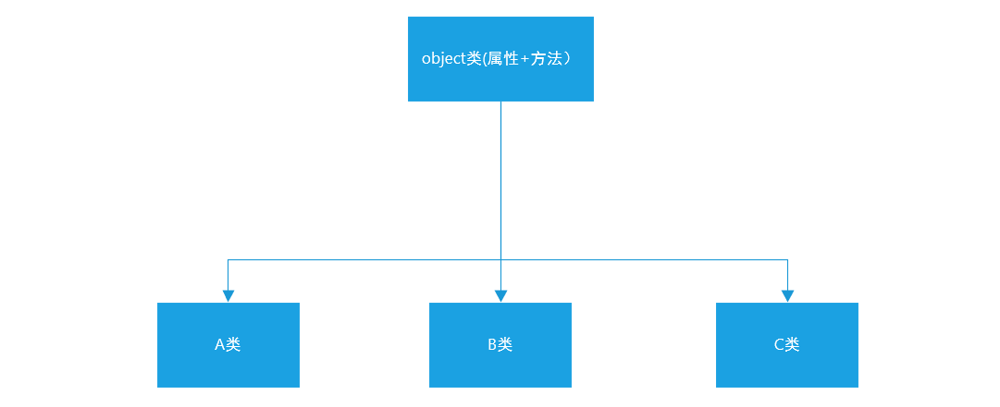
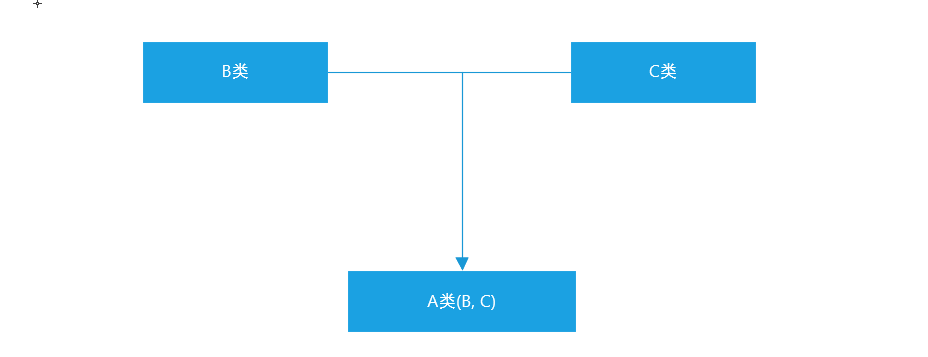
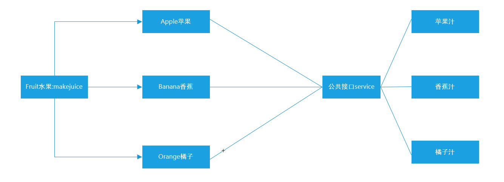
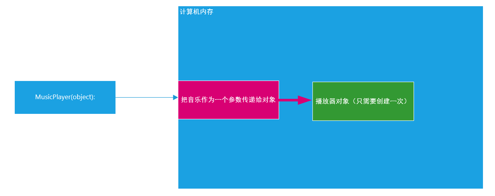
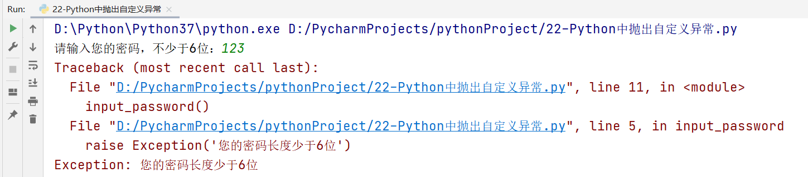

# Python面向对象高级与Python的异常、模块以及包管理

# 一、Python中的继承

## 1、什么是继承

我们接下来来聊聊Python代码中的“继承”：类是用来描述现实世界中同一组事务的共有特性的抽象模型，但是类也有上下级和范围之分，比如：生物 => 动物 => 哺乳动物 => 灵长型动物 => 人类 => 黄种人

从哲学上说，就是共性与个性之间的关系，比如：白马和马！所以，我们在OOP代码中，也一样要体现出类与类之间的共性与个性关系，这里就需要通过类的继承来体现。简单来说，如果一个类A使用了另一个类B的成员（属性和方法），我们就可以说A类继承了B类，同时这也体现了OOP中==代码重用的特性==！

## 2、继承的基本语法

假设A类要继承B类中的所有属性和方法（私有属性和私有方法除外）

```python
class B(object):
    pass

clss A(B):
    pass

a = A()
a.B中的所有公共属性
a.B中的所有公共方法
```

案例：Person类与Teacher、Student类之间的继承关系

```python
class Person(object):
    def eat(self):
        print('i can eat food!')

    def speak(self):
        print('i can speak!')
        
class Teacher(Person):
    pass

class Student(Person):
    pass

teacher = Teacher()
teacher.eat()
teacher.speak()

student = Student()
student.eat()
studnet.speak()
```

## 3、与继承相关的几个概念

继承：一个类从另一个已有的类获得其成员的相关特性，就叫作继承！

派生：从一个已有的类产生一个新的类，称为派生！

很显然，继承和派生其实就是从不同的方向来描述的相同的概念而已，本质上是一样的！


父类：也叫作基类，就是指已有被继承的类！

子类：也叫作派生类或扩展类


扩展：在子类中增加一些自己特有的特性，就叫作扩展，没有扩展，继承也就没有意义了！

单继承：一个类只能继承自一个其他的类，不能继承多个类，单继承也是大多数面向对象语言的特性！

多继承：一个类同时继承了多个父类， （C++、Python等语言都支持多继承）

## 4、单继承

单继承：一个类只能继承自一个其他的类，不能继承多个类。这个类会有具有父类的属性和方法。

基本语法：

```python
# 1、定义一个共性类（父类）
class Person(object):
    pass
# 2、定义一个个性类（子类）
class Teacher(Person):
    pass
```

案例：比如汽车可以分为两种类型（汽油车、电动车）

```python
# 1、定义一个共性类（车类）
class Car(object):
    def run(self):
        print('i can run')
# 2、定义汽油车
class GasolineCar(Car):
    pass
# 3、定义电动车
class EletricCar(Car):
    pass

bwm = GasolineCar()
bwm.run()
```

## 5、单继承特性：传递性

在Python继承中，如A类继承了B类，B类又继承了C类。则根据继承的传递性，则A类也会自动继承C类中所有属性和方法（公共）

```python
class C(object):
    def func(self):
        print('我是C类中的相关方法func')
        
class B(C):
    pass

class A(B):
    pass

a = A()
a.func()
```

## 6、编写面向对象代码中的常见问题

问题1：在定义类时，其没有遵循类的命名规则

答：在Python中，类理论上是不区分大小写的。但是要遵循一定的命名规范：首字母必须是字母或下划线，其中可以包含字母、数字和下划线，而且要求其命名方式采用大驼峰。

电动汽车：EletricCar

父类：Father

子类：Son


问题2：父类一定要继承object么？Car(object)

答：在Python面向对象代码中，建议在编写父类时，让其自动继承object类。但是其实不写也可以，因为默认情况下，Python中的所有类都继承自object。




问题3：打印属性和方法时，都喜欢用print

```python
class Person():
    def __init__(self, name):
        self.name = name
        
    def speak(self):
        print('i can speak')
        
# 创建对象，打印属性和方法
p = Person('Tom')
print(p.name)
p.speak()
```

## 7、多继承

什么是多继承？

Python语言是少数支持多继承的一门编程语言，所谓的多继承就是允许一个类同时继承自多个类的特性。



基本语法：

```python
class B(object):
    pass

class C(object):
    pass

class A(B, C):
    pass

a = A()
a.B中的所有属性和方法
a.C中的所有属性和方法
```

案例：汽油车、电动车 => 混合动力汽车（汽车 + 电动）

```python
class GasolineCar(object):
    def run_with_gasoline(self):
        print('i can run with gasoline')
        
class EletricCar(object):
    def run_with_eletric(self):
        print('i can run with eletric')
        
class HybridCar(GasolineCar, EletricCar):
    pass

tesla = HybridCar()
tesla.run_with_gasoline()
tesla.run_with_eletric()
```

> 注意：虽然多继承允许我们同时继承自多个类，但是实际开发中，应尽量避免使用多继承，因为如果两个类中出现了相同的属性和方法就会产生命名冲突。

## 8、子类扩展：重写父类属性和方法

扩展特性：继承让子类继承父类的所有公共属性和方法，但是如果仅仅是为了继承公共属性和方法，继承就没有实际的意义了，应该是在继承以后，子类应该有一些自己的属性和方法。

什么是重写？

重写也叫作覆盖，就是当子类成员与父类成员名字相同的时候，从父类继承下来的成员会重新定义！

此时，通过子类实例化出来的对象访问相关成员的时候，真正其作用的是子类中定义的成员！

上面单继承例子中 Animal 的子类 Cat和Dog 继承了父类的属性和方法，但是我们狗类Dog 有自己的叫声'汪汪叫'，猫类 Cat 有自己的叫声 '喵喵叫' ，这时我们需要对父类的 call() 方法进行重构。如下：

```python
class Animal(object):
    def eat(self):
        print('i can eat')
    
    def call(self):
        print('i can call')
        
class Dog(Animal):
    pass

class Cat(Animal):
    pass

wangcai = Dog()
wangcai.eat()
wangcai.call()

miaomiao = Cat()
miaomiao.eat()
miaomiao.call()
```

Dog、Cat子类重写父类Animal中的call方法：

```python
class Animal(object):
    def eat(self):
        print('i can eat')
    # 公共方法
    def call(self):
        print('i can call')


class Dog(Animal):
    # 重写父类的call方法
    def call(self):
        print('i can wang wang wang')


class Cat(Animal):
    # 重写父类的call方法
    def call(self):
        print('i can miao miao miao')


wangcai = Dog()
wangcai.eat()
wangcai.call()

miaomiao = Cat()
miaomiao.eat()
miaomiao.call()
```

思考：重写父类中的call方法以后，此时父类中的call方法还在不在？

答：还在，只不过是在其子类中找不到了。类方法的调用顺序，当我们在子类中重构父类的方法后，Cat子类的实例先会在自己的类 Cat 中查找该方法，当找不到该方法时才会去父类 Animal 中查找对应的方法。

## 9、super()调用父类属性和方法

super()：调用父类属性或方法，完整写法：`super(当前类名, self).属性或方法()`，在Python3以后版本中，调用父类的属性和方法我们只需要使用`super().属性或super().方法名()`就可以完成调用了。

案例：Car汽车类、GasolineCar汽油车、ElectricCar电动车

```python
class Car(object):
    def __init__(self, brand, model, color):
        self.brand = brand
        self.model = model
        self.color = color
     def run(self):
        print('i can run')
        
class GasolineCar(Car):
    def __init__(self, brand, model, color):
        super().__init__(brand, model, color)
        
    def run(self):
        print('i can run with gasoline')
        
class ElectricCar(Car):
    def __init__(self, brand, model, color):
        super().__init__(brand, model, color)
        # 电池属性
        self.battery = 70
        
    def run(self):
        print(f'i can run with electric，remain:{self.battery}')
        
bwm = GasolineCar('宝马', 'X5', '白色')
bwm.run()

tesla = ElectricCar('特斯拉', 'Model S', '红色')
tesla.run()
```

## 10、MRO属性或MRO方法：方法解析顺序

MRO(Method Resolution Order)：方法解析顺序，我们可以通过`类名.__mro__`或`类名.mro()`获得“类的层次结构”，方法解析顺序也是按照这个“类的层次结构”寻找到。

```python
class Car(object):
    def __init__(self, brand, model, color):
        self.brand = brand
        self.model = model
        self.color = color
     def run(self):
        print('i can run')
        
class GasolineCar(Car):
    def __init__(self, brand, model, color):
        super().__init__(brand, model, color)
        
    def run(self):
        print('i can run with gasoline')
        
class ElectricCar(Car):
    def __init__(self, brand, model, color):
        super().__init__(brand, model, color)
        # 电池属性
        self.battery = 70
        
    def run(self):
        print(f'i can run with electric，remain:{self.battery}')
        
print(ElectricCar.__mro__)
print(ElectricCar.mro())
```


说明：有MRO方法解析顺序可知，在类的继承中，当某个类创建了一个对象时，调用属性或方法，首先在自身类中去寻找，如找到，则直接使用，停止后续的查找。如果未找到，继续向上一级继承的类中去寻找，如找到，则直接使用，没有找到则继续向上寻找...直到object类，这就是Python类继承中，其方法解析顺序。

> 综上：object类还是所有类的基类（因为这个查找关系到object才终止）

# 二、Python中多态

## 1、什么是多态

多态指的是一类事物有多种形态。


定义：多态是一种使用对象的方式，子类重写父类方法，调用不同子类对象的相同父类方法，可以产生不同的执行结果。

① 多态依赖继承

② 子类方法必须要重写父类方法

> 首先定义一个父类，其可能拥有多个子类对象。当我们调用一个公共方法时，传递的对象不同，则返回的结果不同。


好处：调用灵活，有了多态，更容易编写出通用的代码，做出通用的编程，以适应需求的不断变化！

## 2、多态原理图



公共接口service就是多态的体现，随着传入水果对象的不同，能返回不同的结果。

## 3、多态代码实现

多态：可以基于继承也可以不基于继承

```python
class Fruit(object):
    # 公共方法
    def makejuice(self):
        print('i can make juice')

class Apple(Fruit):
    def makejuice(self):
        print('i can make apple juice')

class Banana(Fruit):
    def makejuice(self):
        print('i can make banana juice')

class Orange(Fruit):
    def makejuice(self):
        print('i can make orange juice')

class Peach(Fruit):
    def makejuice(self):
        print('i can make peach juice')


# 定义公共方法如service
def service(obj):
    obj.makejuice()


apple = Apple()
banana = Banana()
orange = Orange()

for i in (apple, banana, orange):
    service(i)
```

# 三、面向对象其他特性

## 1、类属性

Python中，属性可以分为实例属性和类属性。

类属性就是 类对象中定义的属性，它被该类的所有实例对象所共有。通常用来记录 与这类相关 的特征，类属性 不会用于记录 具体对象的特征。

> 在Python中，一切皆对象。类也是一个特殊的对象，我们可以单独为类定义属性。

```python
class Person(object):
    # 定义类属性
    count = 0
    def __init(self, name, age):
        self.name = name
        self.age = age
        
p1 = Person('Tom', 23)
p2 = Person('Harry', 26)
```

## 2、类属性代码实现

定义count类属性，用于记录实例化Person类，产生对象的数量。

```python
class Person(object):
    # 定义类属性count
    count = 0

    # 定义一个__init__魔术方法，用于进行初始化操作
    def __init__(self, name):
        self.name = name
        # 对count类属性进行+1操作，用于记录这个Person类一共生成了多少个对象
        Person.count += 1

# 1、实例化对象p1
p1 = Person('Tom')
p2 = Person('Harry')
p3 = Person('Jennifer')
# 2、在类外部输出类属性
print(f'我们共使用Person类生成了{Person.count}个实例对象')
```

## 3、类方法

为什么需要类方法，在面向对象中，特别强调数据封装性。所以不建议直接在类的外部对属性进行直接设置和获取。所以我们如果想操作类属性，建议使用类方法。

```python
class Tool(object):
    # 定义一个类属性count
    count = 0
    # 定义一个__init__初始化方法
    def __init__(self, name):
        self.name = name
        Tool.count += 1
    # 封装一个类方法：专门实现对Tool.count类属性进行操作
    @classmethod
    def get_count(cls):
        print(f'我们使用Tool类共实例化了{cls.count}个工具')
        
t1 = Tool('斧头')
t2 = Tool('榔头')
t3 = Tool('铁锹')

Tool.get_count()
```

> 类方法主要用于操作类属性或类中的其他方法。

## 4、静态方法

在开发时，如果需要在类中封装一个方法，这个方法：  

==① 既 不需要访问实例属性或者调用实例方法==

==② 也 不需要访问类属性或者调用类方法==

这个时候，可以把这个方法封装成一个静态方法

```python
# 开发一款游戏
class Game(object):
    # 开始游戏，打印游戏功能菜单
    @staticmethod
    def menu():
        print('1、开始游戏')
        print('2、游戏暂停')
        print('3、退出游戏')

# 开始游戏、打印菜单
Game.menu()
```

# 四、综合案例

## 1、需求分析

设计一个`Game`类

属性：

定义一个类属性`top_score`记录游戏的历史最高分

定义一个实例属性`player_name`记录当前游戏的玩家姓名


方法：

静态方法`show_help`显示游戏帮助信息

类方法`show_top_score`显示历史最高分

实例方法`start_game`开始当前玩家的游戏

## 2、实例代码

```python
class Game(object):
    # 1、定义类属性top_score
    top_score = 0

    # 2、定义初始化方法__init__
    def __init__(self, player_name):
        self.player_name = player_name

    # 3、定义静态方法，用于输出帮助信息
    @staticmethod
    def show_help():
        print('游戏帮助信息')

    # 4、定义类方法
    @classmethod
    def show_top_score(cls):
        print(f'本游戏历史最高分：{cls.top_score}')

    # 5、定义实例方法，start_game()
    def start_game(self):
        print(f'{self.player_name}，游戏开始了，你准备好了么？')


# 实例化类生成实例对象
mario = Game('itheima')
mario.start_game()

# 显示历史最高分
Game.show_top_score()

# 弹出游戏帮助信息
Game.show_help()
```

# 五、面向对象中的单例模式

## 1、什么是设计模式

设计模式就是前人根据实际的问题提出的问题解决方案，我们把这种就称之为设计模式。

## 2、单例模式

单例模式是一种常见的设计模式！

所谓的设计模式，不是一种新的语法，而是人们在实际的应用中，面对某种特定的情形而设计出来的某种常见的有效的解决方案，所以，设计模式只是经验的总结！


什么又是单例模式？单例，就是单一实例！

==在实际的运用中，存在一些类，只需要实例化一个对象，就可以完成其所有的功能操作。所以，如果我们能够通过某些技巧，使得一个类只能开辟一个对象空间的话，这样就可以节省相应的对象资源，这种模式就叫作单例模式！==



应用场景：音乐播放器对象、回收站对象、打印机对象

## 3、\__new__()方法

在Python中，我们目前已经学了3个魔术方法了，分别是`__init__()`、`__str__()`、`__del__()`，接下来介绍一下`__new__()`方法。


使用类名()创建对象时，Python的解释器首先会调用`__new__方法`为对象分配空间。

__new__是一个由object积累提供的内置的静态方法，主要作用有两个：

○ ==在内存中为对象分配空间==

○ ==返回对象的引用==

Python解析器获得对象的引用后，将引用作为第一个参数，传递给`__init__方法`重写`__new__方法`的代码非常固定，一定要使用`return super(). __new__(cls)`，否则Python解释器得不到分配了空间的对象引用，就不会调用对象的初始化方法。

> `__new__方法`是一个静态方法，在调用时，要求将自身类信息cls作为参数传递到这个方法中，这个方法属于object类中的一个静态方法。

案例：

```python
# 定义一个播放器类
class MusicPlayer(object):
    # 重写__new__()魔术方法
    def __new__(cls, *args, **kwargs):
        print('1、开辟内存空间')
        print('2、返回实例化对象引用地址')
        return super().__new__(cls)

    def __init__(self, name):
        self.name = name

# 1、实例mp1对象
mp1 = MusicPlayer('红色的高跟鞋')
print(mp1)

# 2、实例化mp2对象
mp2 = MusicPlayer('春夏秋冬')
print(mp2)
```

## 4、单例模式的代码实现

```python
# 定义一个播放器类
class MusicPlayer(object):
    # 定义一个类属性，如instance，用于记录之前实例化对象返回的内存引用
    instance = None
    # 重写__new__()魔术方法
    def __new__(cls, *args, **kwargs):
        # 判断实例化时有没有分配过内存空间
        if cls.instance is None:
            cls.instance = super().__new__(cls)
        return cls.instance

    def __init__(self, name):
        self.name = name

# 1、实例mp1对象
mp1 = MusicPlayer('红色的高跟鞋')
print(mp1)

# 2、实例化mp2对象
mp2 = MusicPlayer('春夏秋冬')
print(mp2)
```

> 注：类属性在内存中是一个特殊的存在，其不用于以前讲过的局部变量（局部变量当函数执行完毕后，其会被内存所销毁）。但是类属性一旦定义，除非对象以及这个类在内存中被销毁了，否则其不会自动销毁。

# 六、Python异常

## 1、什么是异常

当检测到一个错误时，解释器就无法继续执行了，反而出现了一些错误的提示，这就是所谓的"异常"。

## 2、异常演示

```python
# 运算符
# print(10/0)

# 文件异常
f = open('python.txt', 'r')
content = f.readlines()
print(content)
```

## 3、异常捕获

基本语法：

```python
try:
    可能发生错误的代码
except(捕获):
    如果出现异常执行的代码
```

> try...except主要用于捕获代码运行时异常

案例：

```python
try:
    f = open('python.txt', 'r')
    content = f.readline()
    print(content, end='')
except:
    f = open('python.txt', 'w', encoding='utf-8')
    f.write('发生异常，执行except语句中的代码')

f.close()
```

## 4、捕获指定异常

在以上案例代码中，except相当于捕获了所有异常，无论遇到什么错误都会自动执行except中封装的代码。但是有些情况下，我们向针对性的捕获异常，并执行相应的代码。

基本语法：

```python
try:
    可能遇到异常的代码
except 异常类型:
    捕获到对应的错误以后，执行的代码
```

> ① 如果尝试执行的代码的异常类型和要捕获的异常类型不一致，则无法捕获异常。
>
> ② 一般try下方只放一行尝试执行的代码。

案例：捕获FileNotFoundError异常

```python
try:
    f = open('python.txt', 'r')
except FileNotFoundError as e:
    print(e)
```

## 5、同时捕获多个异常

```python
try:
    print(name)
    # print(10/0)
except (NameError, ZeroDivisionError) as e:
    print(e)
```

## 6、捕获所有未知异常

无论我们在except后面定义多少个异常类型，实际应用中，也可能会出现无法捕获的未知异常。这个时候，我们考虑使用Exception异常类型捕获可能遇到的所有未知异常：

```python
try:
    可能遇到的错误代码
except Exception as e:
    print(e)
```

案例：打印一个未定义变量，使用Exception异常类进行捕获

```python
try:
    print(name)
except Exception as e:
    print(e)
```

## 7、异常捕获中else语句

else语句：表示的是如果没有异常要执行的代码。

```python
try:
    print(1)
except Exception as e:
    print(e)
else:
    print('哈哈，真开森，没有遇到任何异常')
```

案例：

```python
try:
    f = open('python.txt', 'r')
except Exception as e:
    print(e)
else:
    content = f.readlines()
    print(content, end='')
    f.close()
```

## 8、异常捕获中的finally语句

finally表示的是无论是否异常都要执行的代码，例如关闭文件、关闭数据库连接。

```python
try:
    f = open('python.txt', 'r')
except:
    f = open('python.txt', 'w')
else:
    print('哈哈，真开森，没有遇到任何异常')
finally:
    print('关闭文件')
    f.close()
```

## 9、异常的综合案例

### ☆ 异常的传递

需求：

① 尝试只读方式打开python.txt文件，如果文件存在则读取文件内容，文件不存在则提示用户即可。

② 读取内容要求：尝试循环读取内容，读取过程中如果检测到用户意外终止程序，则`except`捕获

```python
import time

try:
   f = open('python.txt', 'r')
   try:
       while True:
           content = f.readline()
           if len(content) == 0:
               break
           time.sleep(3)
           print(content, end='')
   except:
       # Ctrl + C（终端里面，其代表终止程序的继续执行）
       print('python.txt未全部读取完成，中断了...')
   finally:
       f.close()
except:
   print('python.txt文件未找到...')
```

### ☆ raise抛出自定义异常

在Python中，抛出自定义异常的语法为`raise 异常类对象`。

需求：密码长度不足，则报异常（用户输入密码，如果输入的长度不足6位，则报错，即抛出自定义异常，并捕获该异常）。

原生方法：

```python
def input_password():
    password = input('请输入您的密码，不少于6位：')
    if len(password) < 6:
        # 抛出异常
        raise Exception('您的密码长度少于6位')
        return
    # 如果密码长度正常，则直接显示密码
    print(password)
        
input_password()
```



面向对象抛出自定义异常：

```python
class ShortInputError(Exception):
    # length代表输入密码长度，min_length代表ShortInputError最小长度
    def __init__(self, length, min_length):
        self.length = length
        self.min_length = min_length

    # 定义一个__str__方法，用于输出字符串信息
    def __str__(self):
        return f'您输入的密码长度为{self.length}，不能少于{self.min_length}个字符'

try:
    password = input('请输入您的密码，不少于6位：')
    if len(password) < 6:
        raise ShortInputError(len(password), 6)
except Exception as e:
    print(e)
else:
    print(f'密码输入完成，您的密码是：{password}')
```

