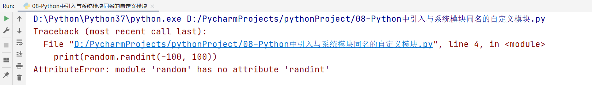
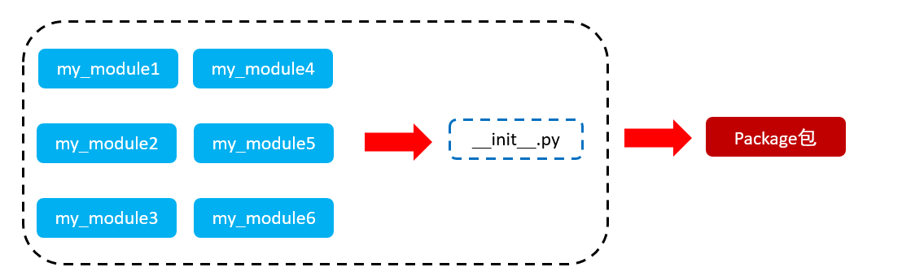
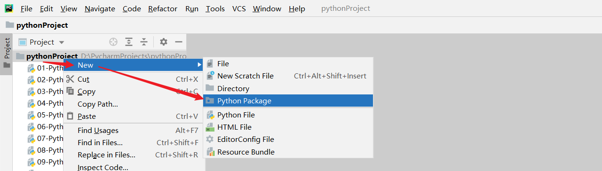
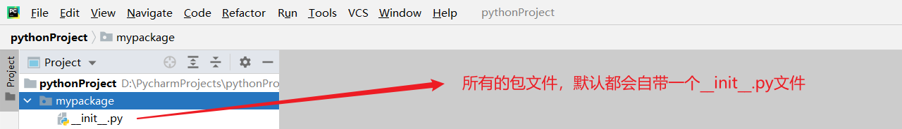

# Python模块、包与面向对象综合案例

# 一、Python内置模块

## 1、什么是Python模块

Python 模块(Module)，是一个==Python 文件==，以 .py 结尾，包含了 Python 对象定义和Python语句。模块能定义==函数，类和变量==，模块里也能包含可执行的代码。

## 2、模块的分类

在Python中，模块通常可以分为两大类：==内置模块(目前使用的)== 和 ==自定义模块==

## 3、模块的导入方式

☆ import 模块名

☆ from 模块名 import 功能名

☆ from 模块名 import *

☆ import 模块名 as 别名

☆ from 模块名 import 功能名 as 别名

## 4、使用import导入模块

基本语法：

```python
import 模块名称
或
import 模块名称1, 模块名称2, ...
```

使用模块中封装好的方法：

```python
模块名称.方法()
```


案例：使用import导入math模块

```python
import math

# 求数字9的平方根 = 3
print(math.sqrt(9))
```

案例：使用import导入math与random模块

```python
import math, random

print(math.sqrt(9))
print(random.randint(-100, 100))
```

> https://fanyi.caiyunapp.com/#/web彩云小译翻译插件

## 5、使用from 模块名 import 功能名

提问：已经有了import导入模块，为什么还需要使用from 模块名 import 功能名这样的导入方式？

答：import代表导入某个或多个模块中的所有功能，但是有些情况下，我们只希望使用这个模块下的某些方法，而不需要全部导入。这个时候就建议采用from 模块名 import 功能名

### ☆ from 模块名 import *

这个导入方式代表导入这个模块的所有功能（等价于import 模块名）

```python
from math import *
```

### ☆ from 模块名 import 功能名（推荐）

```python
from math import sqrt, floor
```


注意：以上两种方式都可以用于导入某个模块中的某些方法，但是在调用具体的方法时，我们只需要`功能名()`即可

```python
功能名()
```


案例：

```python
# from math import *
# 或
from math import sqrt, floor

# 调用方式
print(sqrt(9))
print(floor(10.88))
```

## 6、使用as关键字为导入模块定义别名

在有些情况下，如导入的模块名称过长，建议使用as关键字对其重命名操作，以后在调用这个模块时，我们就可以使用别名进行操作。

```python
import time as t

# 调用方式
t.sleep(10)
```

> 在Python中，如果给模块定义别名，命名规则建议使用大驼峰。

## 7、使用as关键字为导入功能定义别名

```python
from 模块 import 功能名 as 功能名别名
```

案例：

```python
from time import sleep as sl, time as t

# 调用方式
print('hello world')
sl(10)
print('hello python')
```

## 8、扩展：time模块中的time()方法

在Python中，time模块除了sleep方法以外，还有一个方法叫做time()方法

```python
time.time()
```

主要功能：就是返回格林制时间到当前时间的秒数（时间戳）


案例：求运行递归代码的执行时间

```python
import time

# 返回：格林制时间到当前时间的秒数
start = time.time()

# 编写递归函数
def func(n):
    if n == 10:
        return 1
    return (func(n+1) + 1) * 2

print(func(1))

end = time.time()
print(f'以上代码共执行了{end - start}s')
```

# 二、Python中的自定义模块

## 1、什么是自定义模块

在Python中，模块一共可以分为两大类：内置系统模块  和  自定义模块

模块的本质：在Python中，模块的本质就是一个Python的独立文件（后缀名.py），里面可以包含==全局变量、函数以及类==。

> 注：在Python中，每个Python文件都可以作为一个模块，模块的名字就是==文件的名字==。也就是说自定义模块名必须要符合标识符命名规则。

## 2、定义一个自定义模块

案例：在Python项目中创建一个自定义文件，如my_module1.py

```python
def sum_num(num1, num2):
    return num1 + num2
```

## 3、导入自定义模块

```python
import 模块名称
或
from 模块名称 import 功能名
```

案例：

```python
import my_module1


# 调用my_module1模块中自定义的sum_num方法
print(my_module1.sum_num(10, 20))
```

## 4、自定义模块中功能测试

在我们编写完自定义模块以后，最好在模块中对代码进行提前测试，以防止有任何异常。

引入一个魔方方法：`__name__`，其保存的内存就是一个字符串类型的数据。

随着运行页面的不同，其返回结果也是不同的：

① 如果`__name__`是在当前页面运行时，其返回结果为`__main__`

② 如果`__name__`在第三方页面导入运行时，其返回结果为模块名称

基于以上特性，我们可以把`__name__`编写在自定义模块中，其语法如下：

```python
if __name__ == '__main__':
    # 执行测试代码
```


`__name__`魔术方法除了可以在自定义模块中测试使用，还可以用于编写程序的入口：

```python
# 定义一个main方法（入口文件）
def main():
    # 执行我们要执行的功能
    # ① 打印选择菜单
    # ② 添加学员信息
    # ③ 删除学员信息
    # ...
    
# 调用执行入口
if __name__ == '__main__':
    main()
```

## 5、多模块中功能命名冲突问题

### ☆ 命名冲突

当我们编写了多个模块时，可能在导入到其他页面时，会产生一个问题：全局变量、函数、类出现重名情况，我们把这个情况就称之为“命名冲突”。

如导入my_module2和my_module3，里面都封装了一个func()方法，其在导入以后，my_module3中的func()方法就会覆盖my_module2中的func()方法。

my_module2.py

```python
def func():
    print('my_module2中的func方法')
```

my_module3.py

```python
def func():
    print('my_module3中的func方法')
```

导入到其他Python文件中，测试效果：

```python
from my_module2 import func
from my_module3 import func

func()
```

### ☆ 解决方案

① 把所有模块的导入方式都写入文件的最上面，如果发现命名冲突了，马上和模块的开发人员进行功能核对

② 给重名的方法进行as重命名

```python
from my_module2 import func as my_module2_func
from my_module3 import func as my_module3_func
```

## 6、模块命名的注意事项

在实际项目开发中，一定要特别注意：我们自定义的模块名称一定不能和系统内置的模块名称相同，否则会导致代码无法正常执行。


举个栗子：定义一个与系统内置模块同名的模块

random.py

```python

```

08-Python中引入与系统模块同名的自定义模块.py

```python
import random

print(random.randint(-100, 100))
```

以上代码运行结果：



randint属于random模块的内置方法，不可能存在找不到的情况。之所以出现以上问题的主要原因在于：我们的项目中存在了一个与系统模块同名的模块文件。所以其在引用random模块式，其执行顺序：

`引入某个模块 => 当前项目中寻找是否有同名的文件 => 如果找到则直接使用，未找到 => 继续向上寻找 => Python解析器中`

如何证明：模块的引用一定是按照你说的这个顺序呢？

答：使用`__file__`魔术方法

```python
print(random.__file__)
```

## 7、\__all__魔术方法

如果一个模块文件中有`__all__`变量，当使用`from xxx import *`导入时，只能导入这个列表中的元素。

主要功能：限制使用模块中的某些功能，也就是说你导入后可以使用的方法只能是`__all__`中封装好的方法。

案例：

my_module.py

```python
__all__ = ['func1']

def func1():
    print('func1方法')

def func2():
    print('func2方法')
```

09-Python中限制引用模块中的方法.py

```python
from my_module import *

func1()
func2()  # 报错
```

# 三、Python中的Package包

## 1、什么是包

包将有联系的模块组织在一起，即放到同一个文件夹下，并且在这个文件夹创建一个名字为`__init__.py` 文件，那么这个文件夹就称之为包。



## 2、包的制作



新建报名如mypackage：



## 3、在包中创建多个模块

在mypackage包中创建多个模块：my_module1和my_module2

my_module1.py

```python
print('my_module1')
def func1():
    print('mypackage包中的my_module1模块的func1方法')
```

my_module2.py

```python
print('my_module2')
def func2():
    print('mypackage包中的my_module2模块的func2方法')
```

## 4、在项目代码中导入包Package

方法一：使用import导入包

```python
import 包名.模块名

# 调用模块中的方法
包名.模块名.方法名()
```

方法二：使用from导入包

```python
from 包名 import *

# 调用模块方法
模块名.方法名()
```

> 注意：必须在`__init__.py`文件中添加`__all__ = []`，控制允许导入的模块列表。

