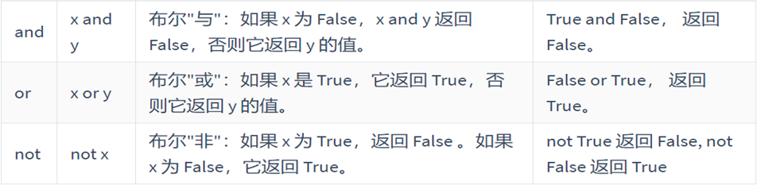
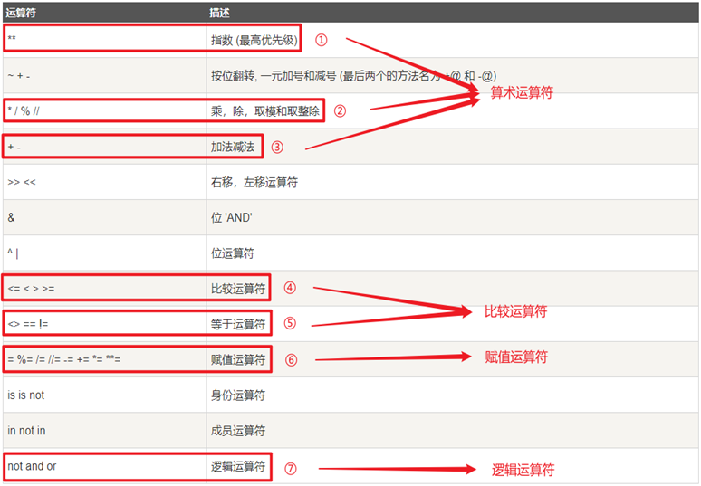
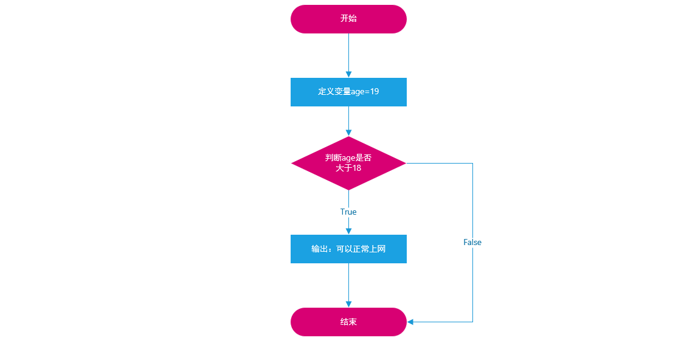
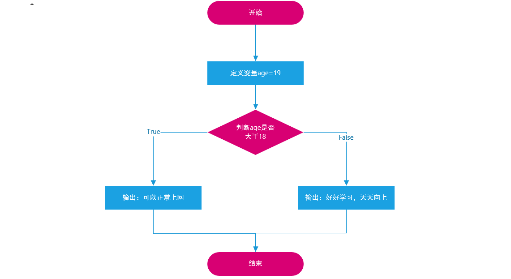
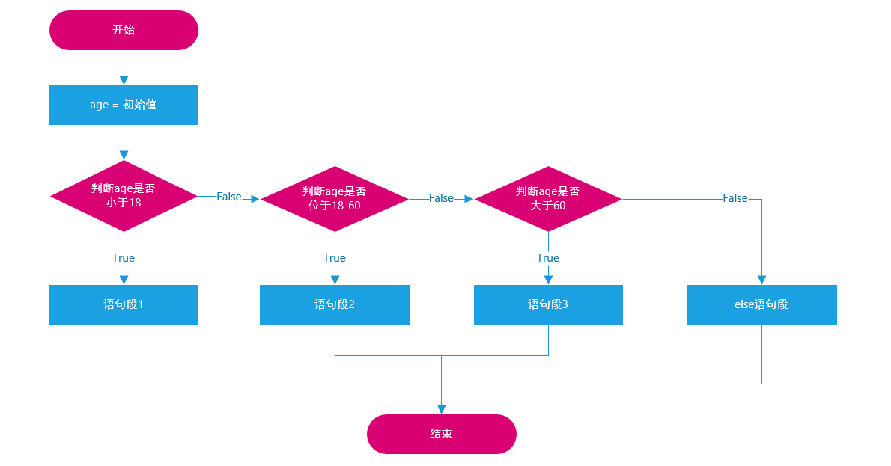

# Day02之Python运算符与if结构

# 一、昨日回顾

## 1、回顾昨天的课程内容

略

## 2、回顾昨天的作业

定义变量，c1 = '可乐'，c2 = '牛奶'，通过Python代码把c1内容调整为牛奶，c2调整为可乐。

```python
# 1、定义两个变量
c1 = '可乐'
c2 = '牛奶'

# 2、使用python将c1和c2的值进行交换（引入第三方变量，如temp）
# 第一步：首先把c2杯中的牛奶放入临时temp杯子中
temp = c2
# 第二步：把c1中值赋值给c2这个变量（相当于把c1中的可乐倒入c2中）
c2 = c1
# 第三步：把temp杯子中的牛奶倒入c1种
c1 = temp

print(f'1号杯中：{c1}')
print(f'2号杯中：{c2}')
```

# 二、Python数据类型转换

## 1、使用Python实现超市的收银系统


Python：

```python
name = input('请输入您要购买商品名称：')
id = input('请输入您要购买商品编号：')
price = input('请输入您要购买的商品价格：')

print(f'您购买了{name}，商品编号为{id}，商品价格为{price}，欢迎下次光临！')
```

以上程序虽然可以按照上图完成程序的正常输出，但是遗留了一个非常严重的问题：这个价格price变量无法参与数学运算（如买了两个奥利奥，应该是18.5 * 2），原因在于input()方法返回的所有的结果都是str字符串类型。

怎么解决以上问题呢？ 答：使用==数据类型转换==

## 2、了解Python数据类型的转换方法

| **函数**                 | **说明**                                            |
| ------------------------ | --------------------------------------------------- |
| ==int(x [,base ])==      | 将x转换为一个整数                                   |
| ==float(x)==             | 将x转换为一个浮点数                                 |
| complex(real  [,imag  ]) | 创建一个复数，real为实部，imag为虚部                |
| ==str(x)==               | 将对象 x  转换为字符串                              |
| repr(x)                  | 将对象  x  转换为表达式字符串                       |
| ==eval(str)==            | 用来计算在字符串中的有效Python表达式,并返回一个对象 |
| tuple(s)                 | 将序列 s  转换为一个元组                            |
| list(s)                  | 将序列 s  转换为一个列表                            |
| chr(x)                   | 将一个整数转换为一个Unicode字符                     |
| ord(x)                   | 将一个字符转换为它的ASCII整数值                     |
| hex(x)                   | 将一个整数转换为一个十六进制字符串                  |
| oct(x)                   | 将一个整数转换为一个八进制字符串                    |
| bin(x)                   | 将一个整数转换为一个二进制字符串                    |

案例1：把用户输入的幸运数字，转换为整型

```python
num = input('请输入您的幸运数字：')
print(type(num))

# 数据类型转换，把str字符串类型转换为int类型
print('-' * 20)

num = int(num)
print(type(num))
```

以上代码还可以简写为：

```python
num = int(input('请输入您的幸运数字：'))
print(type(num))
```

案例2：多种数据类型转换

```python
# 1、整型转浮点类型 int => float
num1 = 10
print(float(num1))
print(type(float(num1)))

print('-' * 20)

# 2、浮点类型转换为整型 float => int，浮点转整型，其小数点后的数据会丢失！！！
num2 = 18.88
print(int(num2))

print('-' * 20)

# 3、把字符串类型转换为整型或浮点类型
str1 = '20'
str2 = '10.88'
print(type(int(str1)))
print(type(float(str2)))
```

案例3：eval()方法的使用，把字符串中的数字转换为原数据类型

```python
price = input('请输入您购买商品的价格：')
print(eval(price))
print(type(eval(price)))
```

str1 = '10'   经过eval(str1)   转换为int类型

str2 = '10.88'  经过eval(str1)  转换为float类型

## 3、总结

数据类型转换方法一共学了4个方法：

int() ：转整型

float() ：转浮点类型

str() ：转字符串类型

eval() ：把字符串转换为原数据类型

但是要特别注意：当float浮点类型转换为int整型时，其小数点后面的数据会丢失，一定要记住这个特性。

# 三、Python运算符

## 1、运算案例


需求：用户手工输入梯形的上底、下底以及高，能直接通过Python打印出梯形的面积为多少。

## 2、算术运算符

所谓的算数运算符就是我们日常生活中的加减乘除等待。

| **运算符** | **描述**     | **实例**                                                 |
| ---------- | ------------ | -------------------------------------------------------- |
| +          | 加           | 1 +  1 输出结果为  2                                     |
| -          | 减           | 1 -  1 输出结果为  0                                     |
| *          | 乘           | 2 *  2 输出结果为  4                                     |
| /          | 除           | 10  / 2 输出结果为  5                                    |
| //         | 整除         | 9  // 4 输出结果为 2                                     |
| %          | 取余（取模） | 9 %  4 输出结果为  1                                     |
| **         | 幂指数       | 2  ** 4 输出结果为  16，即2的4次方，2  * 2 * 2 * 2       |
| ()         | 小括号       | 小括号用来提高运算优先级，即  (1  + 2) * 3 输出结果为  9 |

案例1：了解一下算术运算符

```python
num1 = 10
num2 = 2

# 四则运算 + - * /
print(f'加：{num1 + num2}')
print(f'减：{num1 - num2}')
print(f'乘：{num1 * num2}')
print(f'除：{num1 / num2}')
```

 案例2：和其他编程语言不太相同的几个算术运算符

```python
num1 = 20
num2 = 6
num3 = 5

# 1、整除
print(f'整除：{num1 // num2}')
# 2、求余数
print(f'余数：{num1 % num2}')
# 3、幂指数
print(f'幂指数：{num2 ** 3}')
# 4、圆括号
print(f'优先级：{(num1 + num2) * num3}')
```

## 3、算术运算符案例：求梯形的面积

知识点：用户输入、数据类型转换以及算术运算符

```python
a = float(input('请输入上底：'))
b = float(input('请输入下底：'))
h = float(input('请输入高：'))

s = (a + b) * h / 2

print(f'梯形的面积：{s}')
```

## 4、赋值运算符

| **运算符** | **描述** | **实例**                          |
| ---------- | -------- | --------------------------------- |
| =          | 赋值     | 将=右侧的结果赋值给等号左侧的变量 |

案例1：把某个值赋值给某个变量

```python
num = 10
```

案例2：多个变量同时进行赋值操作

```python
n = 5
f = 10.88
s = 'hello world'
```

简写为：

```python
n, f, s = 5, 10.88, 'hello world'
print(n)
print(f)
print(s)
```

案例3：多个变量赋予相同的值

```python
a = 10
b = 10
```

简写为：

```python
a = b = 10
```

## 5、复合赋值运算符

复合赋值运算符 = 算术运算符 结合 赋值运算符


> 复合赋值运算符的计算顺序 = 先执行算术运算符，执行完毕后，把结果在赋值给左边的变量。

案例：综合案例

```python
i = 1
# 相加并赋值，先加1，然后把结果赋值给左边的变量
i += 1
print(f'更新后，i的值为：{i}')

num1 = 9
# 取模并赋值，先求余数，然后在把结果赋值给左边的变量
num1 %= 2
print(f'更新后，num1的值为：{num1}')

num2 = 2
# 幂指数并赋值，先求幂指数，然后把结果赋值给左边的变量
num2 **= 3
print(f'更新后，num2的值为：{num2}')
```

## 6、比较运算符


> 特别注意：当我们使用比较运算符对两个变量进行比较时，其返回一个布尔类型的值。

案例：两个数大小的比较

```python
num1 = 10
num2 = 20

print(num1 > num2)  # False
print(num1 < num2)  # True
print(num1 >= num2) # False
print(num1 <= num2) # True
print(num1 == num2) # False
print(num1 != num2) # True
```

## 7、练习题

练习题1：提示用户输入圆的半径，根据公式S = πr2求圆的面积 

```python
r = float(input('请输入要计算圆的半径：'))
PI = 3.14
s = PI * r ** 2
print(f'圆的面积为：{s}')
```

练习题2：赋值运算 => 输入身高，体重，求BMI = 体重(kg)/身高(m)的平方。

```python
height = float(input('请输入您的身高（m）：'))
weight = float(input('请输入您的体重（kg）：'))

bmi = weight / height ** 2

print(f'您的BMI值为{bmi}')
```

## 8、逻辑运算符（与或非）



> not就是取反，只有一个表达式`not 表达式`，如果表达式为True，则not以后就返回False。反之，则返回True。

讲个非诚勿扰的小故事：

① 女孩子要求比较高，要求男孩子必须要有房且有车

```python
表达式1 and 表达式2
当表达式1为True且表达式2为True时，则整个表达式返回结果为True
当表达式1或表达式2中有一个表达式为假，则整个表达式返回结果为False


有房 and 有车  则  牵手成功
有房 and 没车  则  牵手失败
没房 and 有车  则  牵手失败
```

② 女孩子要求一般，要求男孩子有房或者有车即可

```python
表达式1 or 表达式2
当表达式1为True或表达式2为True时，则整个表达式返回结果为True
当表达式1与表达式2都为False时，则整个表达式才会返回False


有房 or 有车  则  牵手成功
有房 or 没车  则  牵手成功
没房 or 有车  则  牵手成功
没房 or 没车  则  牵手失败
```

案例：

```python
a = 1
b = 2
c = 3

print((a > b) and (b > c))  # False
print((a > b) or (b > c))   # False
print((a < b) or (b > c))   # True
print(not (a > b))          # True
```

## 9、扩展：短路运算

```python
print(3 and 4 and 5)  # 5
print(5 and 6 or 7)   # 6
4 > 3 and print('hello world')  # 输出hello world
```

在逻辑运算中，不一定逻辑运算符的两边都是纯表达式。也可以是数值类型的数据。

==Python把0、空字符串和None看成 False，其他数值和非空字符串都看成 True==，所以：

① 在计算 a and b 时，如果 a 是 False，则根据与运算法则，整个结果必定为 False，因此返回 a；如果 a 是 True，则整个计算结果必定取决与 b，因此返回 b。

```python
print(3 and 4)  # 4
print(0 and 1)  # 0
```

② 在计算 a or b 时，如果 a 是 True，则根据或运算法则，整个计算结果必定为 True，因此返回 a；如果 a 是 False，则整个计算结果必定取决于 b，因此返回 b。 所以Python解释器在做布尔运算时，只要能提前确定计算结果，它就不会往后算了，直接返回结果。

```python
print(6 or 7)  # 6
print(6 and 7 or 8)  # 7
```

## 10、运算符的优先级

什么是运算符的优先级？其实我们小学就已经接触过了，就是在一个表达式中，我们先算谁的问题。

> 先算乘除，后算加减，有括号的先算括号里面的。



个人建议：

> ① 不要把一个表达式写得过于复杂，如果一个表达式过于复杂，尝试把它拆分来书写

> ② 不要过于依赖运算符的优先级来控制表达式的执行顺序，这样可读性太差，应尽量使用( )来控制表达式的执行顺序

# 四、if选择判断结构

## 1、if选择判断结构作用

在日常开发中，只要有需要进行条件判断的语句基本上都是选择判断结构。

应用场景：

如果年龄大于等于18岁，则可以正常上网。

如果升级考试成绩大于60分，则可以顺利升级就业班。

## 2、if选择判断结构的基本语法

Java：

```python
if (条件判断) {
    则执行某段代码...
}
```

但是Python中，不需要使用这么多复杂的符号，直接可以编写条件判断及执行某段代码

Python：

```python
if 条件判断:
    则执行某段代码... 
    
print()
```

案例代码：

```python
if True:
    print('条件成立执行的代码1')
    print('条件成立执行的代码2')

# 下方的代码没有缩进到if语句块，所以和if条件无关
print('我是无论条件是否成立都要执行的代码')
```

## 3、if选择结构案例

需求：定义一个变量age = 18，判断这个变量是否大于等于18岁，如果满足条件，则可以上网。

案例1：直接定义判断，进行条件判断

```python
age = 18
if age >= 18:
    print('满足18岁要求，可以正常上网')
```

案例2：上网吧案例升级版

```python
age = int(input('请输入您的年龄：'))
if age >= 18:
    print('满足18岁要求，可以正常上网')
```

if选择原理图：学编程除了会写代码还不行，还要回画图（流程图）



## 4、if...else...结构

基本语法：

```python
if 条件判断:
    当条件判断为True时，则执行这个语句段
else:
    当条件判断为False时，则执行这个语句段
```

案例3：上网吧案例升级升级版，引入else

```python
age = int(input('请输入您的年龄：'))
if age >= 18:
    print('满足18岁要求，可以正常上网')
else:
    print('不满足18岁要求，回家好好学习，天天向上')
```

if...else...结构原理图：



## 5、if...elif...else多条件判断结构

如果条件1成立，则执行语句段1

如果条件2成立，则执行语句段2

...

当所有条件都不成立时，则执行else语句段中的内容

```python
if 条件判断1:
    如果此条件为True，则执行这个语句段
elif 条件判断2:
    如果此条件为True，则执行这个语句段
elif ...:
    ...
else:
    如果以上所有条件判断都不满足时，则执行这个语句段
```

案例：

① 中国合法工作年龄为18-60岁，即如果年龄小于18的情况为童工，不合法；

② 如果年龄在18-60岁之间为合法工龄；

③ 大于60岁为法定退休年龄。

```python
# 定义一个变量，接收用户输入的年龄
age = int(input('请输入您的年龄：'))
if age < 18:
    print('你还是一个童工，回去好好学习')
elif age >= 18 and age <=60:
    print('合法工龄，可以正常工作')
elif age > 60:
    print('您已经达到了退休年龄，回家好好休息')
else:
    print('信息输入有误，请重新输入')
```

简写形式：

```python
# 定义一个变量，接收用户输入的年龄
age = int(input('请输入您的年龄：'))
if age < 18:
    print('你还是一个童工，回去好好学习')
elif 18 <= age <= 60:
    print('合法工龄，可以正常工作')
elif age > 60:
    print('您已经达到了退休年龄，回家好好休息')
else:
    print('信息输入有误，请重新输入')
```

if多重条件判断原理图：



## 6、if嵌套结构

基本语法：

```python
if 外层条件判断:
    # 如果条件为True，则执行以下语句段
    if 内层条件判断:
        # 如果内层条件为True，则执行以下语句段
else:
    # 如果条件为False，则执行以下语句段
```

嵌套结构看起来异常复杂，但是我们在编写时要遵循一个原则：==先编写外层判断，所有语句编写完成后，在编写内层条件判断结构。==

案例：外层条件①，是否有钱，有钱可以上车。内层条件 ② 判断是否有空座位，如果有，则可以坐下。 

```python
"""
根据条件（是否有钱）判断是否可以上车
money = 0 没钱
money = 1 有钱
"""
money = 1
seat = 0
if money == 1:
    # 有钱，可以上车
    print('有钱，可以上车')
    # if嵌套（seat = 1代表有空座，seat = 0代表没有空座）
    if seat == 1:
        # 有座位，可以坐下
        print('有座位，可以坐下')
    else:
        # 没有座位，只能站着回家了
        print('没有座位，只能站着回家了')
else:
    # 没钱，只能走路回家了
    print('没钱，只能走路回家了')
```

# 五、综合案例：石头剪刀布

## 1、需求分析

参与游戏的角色有两个（玩家 与 电脑），玩家手工出拳，电脑随机出拳，根据石头剪刀布判断输赢。

玩家：player（玩家手工输入石头、剪刀、布）

电脑：computer（随机出拳）

输赢结果很重要，有三种情况：

① 玩家赢

☆ player：石头  赢 computer：剪刀

☆ palyer：剪刀  赢 computer：布

☆ player：布      赢 computer：石头

② 平局

只要player 与 computer出拳相等，就代表平局

③ 电脑赢

如果不满足以上两个条件，则电脑获胜！

> 未知知识点：如何让计算机随机出拳 => 随机

## 2、代码实现

确认：if...elif...else多条件分支结构

```python
# 第一步：提示输入输入石头剪刀布，0-代表石头，1代表剪刀，2代表布
player = int(input('请输入您的出拳0-代表石头，1代表剪刀，2代表布：'))
# 第二步：电脑随机出拳(后续解决)
computer = 1
# 第三步：根据用户以及计算机的出拳判断输赢
# 什么情况，玩家会赢
# player==0且computer==1 或 palyer==1且computer==2 或 player==2且computer==0
if (player == 0 and computer == 1) or (player == 1 and computer == 2) or (player==2 and computer == 0):
	print('玩家获胜')
elif player == computer:
	print('平局')
else:
    print('电脑获胜')
```

遗留问题：计算机没办法随机出拳

## 3、随机出拳

Python语言非常的强大，强大之处就在于其拥有很多模块（module），这些模块中拥有很多别人已经开发好的代码，我们可以直接导入到我们的程序中即可使用。

==① import导入模块==

==② 通过模块.方法()调用相关功能==

随机出拳其实就是随机从0,1,2中选出一个数字

```python
import random


# 调用内部封装的方法
computer = random.randint(0, 2)
```

改进猜拳代码：

```python
import random


# 第一步：提示输入输入石头剪刀布，0-代表石头，1代表剪刀，2代表布
player = int(input('请输入您的出拳0-代表石头，1代表剪刀，2代表布：'))
# 第二步：电脑随机出拳(后续解决)
computer = random.randint(0, 2)

print(computer)

# 第三步：根据用户以及计算机的出拳判断输赢
# 什么情况，玩家会赢
# player==0且computer==1 或 palyer==1且computer==2 或 player==2且computer==0
if (player == 0 and computer == 1) or (player == 1 and computer == 2) or (player==2 and computer == 0):
	print('玩家获胜')
elif player == computer:
	print('平局')
else:
    print('电脑获胜')
```

# 六、三目运算符

## 1、什么是三目运算符

在Python中三目运算符也叫三元运算符，其主要作用：就是用于简化if...else...语句。

## 2、基本语法

```python
if 条件判断:
    # 语句段1
else:
    # 语句段2
```

转换为三目运算符：

```python
语句段1 if 条件判断 else 语句段2
```

## 3、三目运算符案例

需求：输入两个数值，返回最大值

```python
num1 = 10
num2 = 20

if num1 > num2:
    print(f'最大值为{num1}')
else:
    print(f'最大值为{num2}')
```

简化：三目运算符

```python
num1 = 10
num2 = 20

max = num1 if num1 > num2 else num2
print(f'最大值为{max}')
```

