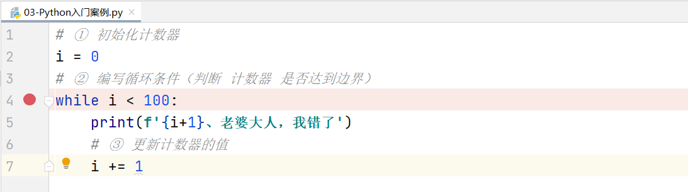
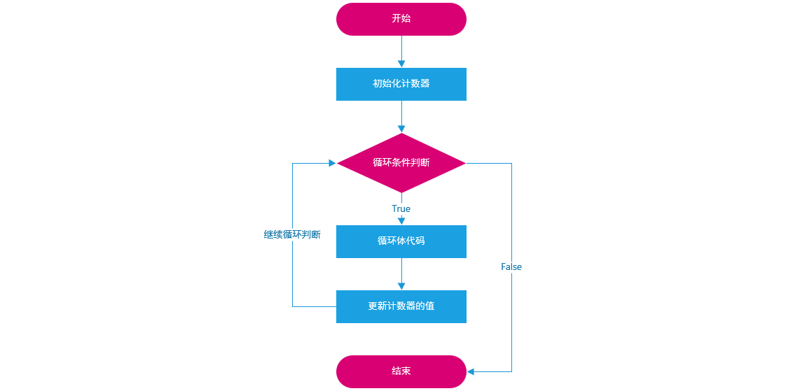
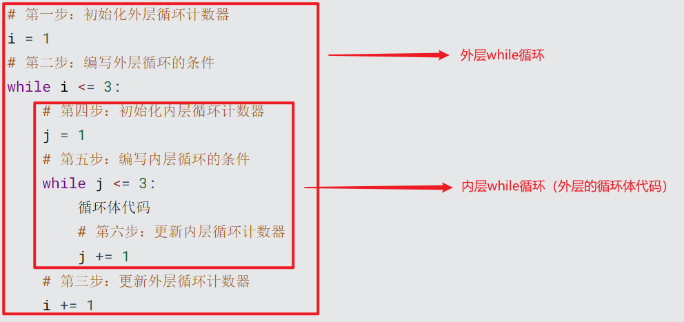
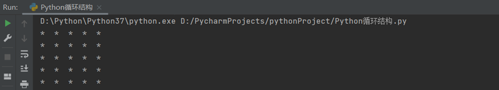
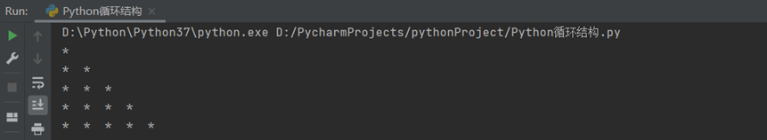
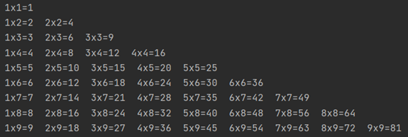

# Python中的循环结构

# 一、回顾分支练习题

## 1、判断是否为一个合法三角形

需求：输入三角形的3边，如果两边的长度大于第三条边，则代表是一个合法三角形

```python
# 1、提示用户输入三角形的三边长度
a = int(input('请输入第一条边的长度：'))
b = int(input('请输入第二条边的长度：'))
c = int(input('请输入第三条边的长度：'))
# 2、判断两边之和是否大于第3条边
if (a + b > c) and (a + c > b) and (b + c > a):
    print('是一个合法的三角形')
else:
    print('不是一个合法的三角形')
```

## 2、求世界杯小组赛的总成绩

需求：世界杯案例，世界杯小组赛的比赛规则是我们的球队与其他三支球队进行比赛，然后根据总成绩(积分)确定出线资格。小组赛球队实力已知(提示用户输入各球队实力），我们通过一个数字表示。如果我们赢1局得3分，平一局得1分，输一局得0分，最终求球队总成绩。

我们的球队实力：20

1号球队的实力：10

2号球队的实力：20

3号球队的实力：30

如果：我们 > 1号球队，赢了，得3分

​             我们 == 2号球队，平局，得1分

​            我们 < 3号球队，输了，得0分

则小组赛最终结果 = 3 + 1 + 0 = 4分

```python
# 1、提示用户输入我们球队与其他三个球队的实力
a = int(input('请输入我们球队的实力值：'))
b = int(input('请输入1号球队的实力值：'))
c = int(input('请输入2号球队的实力值：'))
d = int(input('请输入3号球队的实力值：'))

# 2、开始比赛，求每次比赛的成绩
avsb = (a > b) * 3 + (a == b)
avsc = (a > c) * 3 + (a == c)
avsd = (a > d) * 3 + (a == d)

# 3、总成绩
score = avsb + avsc + avsd

# 4、输出总成绩
print(f'我们球队最终的总成绩：{score}')
```

> 知识点：布尔类型转换为整型，True => int(True) = 1，False => int(False) = 0。这是手工类型转换，在Python中，如果布尔类型参与算术运算，则会发生自动类型转换。

# 二、Python中循环的介绍

## 1、什么是循环

现实生活中，也有很多循环的应用场景：

（1）食堂阿姨打菜：接过顾客的餐盘→询问菜品→打菜→递回餐盘，重复以上过程，直到所有顾客的菜都打完了

（2）快递员送快递：查看送件地址→赶往目的地→电话告知收件人→收件人签收→交快递件，重复以上过程，直到所有需要送的快递都处理完了。

（3）公交司机……

（4）作业流程……

……


以上场景都有一个共同的特点：==有**条件**地**重复**地做一件事，每一次做的事情不同但类似。==

程序是为了解决实际问题的，==实际问题中存在着重复动作，那么程序中也应该有相应的描述，这就是**循环**。==

## 2、循环的作用

思考：假如我有个女朋友，有一天我们闹矛盾生气了，女朋友说：道歉，说100遍“老婆大人，我错了”。这个时候程序员会怎么做？

答：100遍print('老婆大人，我错了')


太麻烦了，有没有更好的办法呢？我们难道print输出语句要复制粘贴100次嘛？

答：其实不用这么麻烦，以上输出代码中有很多重复的地方，我们只要重复执行100次相同的代码即可，这就是循环！


循环的作用是什么？

答：==让代码高效的重复执行==

## 3、循环的种类

在Python中，循环一共分为两大类：while循环与for循环

思考问题：while循环和for循环如何选择呢？

==① 对于循环次数已知的情况，建议使用while循环==

==② 对于循环次数未知的情况，建议使用for循环==


# 三、while循环基本语法及其应用

## 1、while循环的基本语法

```3 
# ① 定义一个计数器（初始化一个计数器）
i = 0或1
# ② 编写while循环结构
while 循环条件(判断 计数器 是否达到了目标位置):
	循环体1
	循环体2
	...
	# ③ 在循环内部更新计数器
	i = i + 1 或 i += 1
```

> 普及小知识：在计算机程序中，计数器大部分都是从0开始的。

总结：while循环三步走

==① 初始化计数器==

==② 编写循环条件（判断计数器是否达到了目标位置）==

==③ 在循环内部更新计数器==

while循环入门案例：使用while循环，循环输出100遍“老婆大人，我错了”

```python
# ① 初始化计数器
i = 0
# ② 编写循环条件（判断计数器是否达到了100）
while i < 100:
    print('老婆大人，我错了')
    # ③ 在循环体内部更新计数器
    i += 1
```

## 2、while循环的执行流程

建议大家使用Debug调试工具，查看while循环的运行流程。

```python
# ① 初始化计数器
i = 0
# ② 编写循环条件（判断计数器是否达到了100）
while i < 100:
    print('老婆大人，我错了')
    # ③ 在循环体内部更新计数器
    i += 1
```

下断点，开始Debug调试：



① 代码都是顺序执行，首先执行到第2行，对变量i进行赋值操作，初始值为0

② 当程序遇到while循环时，首先要把我们的计数器与循环条件进行比较i < 100，如果条件成立，则进入循环内部，执行内部代码。

③ 在循环体内部，针对本次循环进行计数器更新操作 i = i + 1或 i += 1

④ 更新完毕后，把更新后的计数器与循环条件再次进行比较i < 100，如果条件成立，继续进入循环内部，执行内部代码。

...

⑤ 直到，i更新后结果为100时，再次进行循环条件判断，发现不满足，则整个while循环结束。

while循环流程图：



## 3、while循环案例

案例1：使用while循环求1..100的和

分析：定义一个while循环，让其可以帮助我们计算 1 + 2 + 3 + 4 + 5 ... + 100，结果：5050

大问题拆解为小问题：

① 使用while循环，循环100次

```python
# 第一步：初始化计数器
i = 1
# 第二步：编写循环条件
while i <= 100:
    print(i)		#  1 2 3 4 5 6 7 8 9 10...
    # 第三步：更新计数器的值
    i += 1
```

② 在循环体内部，累计求和

```python
# 第四步：定义一个变量，用于得到最终的运算结果
result = 0
# 第五步：想办法，让result = 变量i累加后的结果
```

③ 最终代码

```python
# 第一步：初始化计数器
i = 1
# 第四步：定义一个result变量，用于接收累加后的结果
result = 0
# 第二步：编写循环条件
while i <= 100:
    # 第五步：循环累加变量i
    result += i
    # 第三步：更新计数器的值
    i += 1
print(f'1~100累加后的结果：{result}')
```

☆ 首先定义变量i和变量result，进行初始化赋值

☆ 判断变量i是否满足循环条件，如果满足循环条件，则进入到循环体内部，执行内部代码

思考：如何让变量i进行累加，然后赋予给result

```python
result = i
```

第一次循环式，i = 1，result = 0，如果想获取累加的结构，则result = result + i

```python
result = 0 + 1
```

计数器更新，i += 1，i变成2，然后i <= 100，继续执行循环内部代码

```python
result = result + i  换成数值  result = 1 + 2
```

依次类推

```python
result = result + i
```

简写

```python
result += i
```


案例2：求1~100之间，所有偶数的和

什么是偶数：所谓的偶数，就是能被2整除的数字就是偶数，数学中可以使用2n来表示偶数。(Python代码 => if  数值 % 2 == 0 代表它是一个偶数)

知识点：在while循环中，我们还可以结合if进行判断。

第一步：求出1~100之间，所有的偶数

```python
# 初始化计数器
i = 1
# 编写循环条件
while i <= 100:
    # 将来写代码的位置
    # 更新计数器
    i += 1
```

第二步：在循环体中，引入if条件判断，判断变量i是否为一个偶数

```python
# 初始化计数器
i = 1
# 编写循环条件
while i <= 100:
    # 将来写代码的位置
    if i % 2 == 0:
        # 代表变量i是一个偶数
        print(i)
    # 更新计数器
    i += 1
```

第三步：引入result变量，初始值为0，然后对第二步中得到的所有偶数进行累加

```python
# 初始化计数器
i = 1
# 定义result，用于接收所有偶数的和
result = 0
# 编写循环条件
while i <= 100:
    # 将来写代码的位置
    if i % 2 == 0:
        # 代表变量i是一个偶数
        result += i
    # 更新计数器
    i += 1
print(f'1~100之间所有偶数的和：{result}')
```

## 4、编写循环式常见问题

```python
i = 1
result = 0
while i <= 100:
    if i % 2 == 0:
        result += i
        i += 1
print(f'1~100之间所有偶数的和：{result}')
```

问题的原因：在于i += 1缩进了2次，导致其和if形成了一个整体。while循环中计数器无法更新，最终导致以上代码出现了死循环。

# 四、循环中的两大关键词

## 1、两大关键词

在Python循环中，经常会遇到两个常见的关键词：break 与 continue

break：代表终止整个循环结构

continue：代表中止当前本次循环，继续下一次循环

## 2、举个栗子

举例：一共吃5个苹果，吃完第一个，吃第二个…，这里"吃苹果"的动作是不是重复执行？

情况一：如果吃的过程中，吃完第三个吃饱了，则不需要再吃第4个和第5个苹果，即是吃苹果的动作停止，这里就是break控制循环流程，即终止此循环。

情况二：如果吃的过程中，吃到第三个吃出一个大虫子...,是不是这个苹果就不吃了，开始吃第四个苹果，这里就是continue控制循环流程，即退出当前一次循环继而执行下一次循环代码。

## 3、break关键字

情况一：如果吃的过程中，吃完第三个吃饱了，则不需要再吃第4个和第5个苹果，即是吃苹果的动作停止，这里就是break控制循环流程，即终止此循环。

```python
# 初始化计数器
i = 1
# 编写循环条件
while i <= 5:
    # 当变量i == 4的时候，终止循环
    if i == 4:
        print('我已经吃饱了，实在吃不下了...')
        break
        
    # 正在吃第几个苹果
    print(f'正在吃第{i}个苹果')
    
    # 更新计数器
    i += 1
```

## 4、continue关键字

情况二：如果吃的过程中，吃到第三个吃出一个大虫子...,是不是这个苹果就不吃了，开始吃第四个苹果，这里就是continue控制循环流程，即退出当前一次循环继而执行下一次循环代码。

```python
# 初始化计数器
i = 1
# 编写循环条件
while i <= 5:
    # 当变量i == 3的时候，中止当前循环，继续下一次循环
    if i == 3:
        # 手工更新计数器(非常重要)
        i += 1
        print('吃到了一只大虫子，这个苹果不吃了...')
        continue
        
    print(f'正在吃第{i}个苹果')
    # 更新计数器
    i += 1
```

如果在使用continue的时候，不手工更新计数器会有什么后果呢？

答：会出现死循环，建议使用Debug调试工具观看

## 5、死循环概念

在编程中一个靠自身控制无法终止的程序称为“死循环”。

在Python中，我们也可以使用while True来模拟死循环：

```python
while True:
    print('你是风儿我是沙，缠缠绵绵到天涯')
```

## 6、while循环案例：猜数字

需求：计算机从1 ~ 10之间随机生成一个数字，然后提示输入数字，如果我们输入的数字与随机数相等，则提示恭喜你，答对了。如果输入的数字比随机数大，则提示，猜大了。反之，则提示猜小了，一共有3次机会。

分析：① 编写一个循环，循环3次。② 要从1 ~ 10之间选择一个随机数 ③ if分支判断

```python
import random
# 第一步：定义一个计数器
i = 0
# 第四步：生成1 ~ 10之间的随机数
secretNum = random.randint(1, 10)
# 第二步：编写循环条件
while i < 3:
    # 第五步：提示用户输入一个数字
    userNum = int(input('请输入您猜的数字（范围1~10之间）:'))
    # 第六步：判断用户输入的数字是否与随机数相等
    if secretNum == userNum:
        print('恭喜你，才对了')
        break
    elif secretNum < userNum:
        print('猜大了')
    elif secretNum > userNum:
        print('猜小了')
    # 第三步：更新计数器
    i += 1
```

# 五、while循环嵌套

## 1、循环嵌套的引入

故事梗概：有天女朋友又生气了，惩罚：说3遍“老婆大人， 我错了”，这个程序是不是循环即可？但如果女朋友说：还要刷今天晚饭的碗，这个程序怎么书写？

```python
# 初始化计数器
i = 1
# 编写循环条件
while i <= 3:
    print('老婆大人，我错了')
    # 更新计数器
    i += 1
print('刷今天的碗')
```

但如果女朋友还是生气，把这套惩罚要连续3天都执行，有如何书写程序？

```python
# 初始化外层计数器
j = 1
# 编写外层循环条件
while j <= 3:
    # 初始化计数器
    i = 1
    # 编写循环条件
    while i <= 3:
        print('老婆大人，我错了')
        # 更新计数器
        i += 1
    print('刷今天的碗')
    # 更新外层计数器
    j += 1
```

## 2、循环嵌套的基本语法

编写一个简单的while循环结构

```python
# 初始化计数器
i = 0 或 i = 1
# 编写循环条件
while i < 边界值:
    循环体代码
    # 更新计数器
    i += 1
```

所谓的while嵌套循环就是在while循环的基础上，把循环体代码更换为一层while循环，就组成了while嵌套循环。

```python
# 第一步：初始化外层循环计数器
i = 1
# 第二步：编写外层循环的条件
while i <= 3:
    # 第四步：初始化内层循环计数器
    j = 1
    # 第五步：编写内层循环的条件
    while j <= 3:
        循环体代码
    	# 第六步：更新内层循环计数器
    	j += 1
    # 第三步：更新外层循环计数器
    i += 1
```

结构如下：



## 3、循环嵌套的执行流程

while循环嵌套执行流程口诀：在while循环嵌套的执行过程中，==外层循环1次，内层循环N次。==（时钟 => 分针和秒针，分针就相当于外层循环，秒针就相当于内层循环）

想具体了解while嵌套循环的执行流程，建议使用Debug调试。

循环嵌套的总次数 = 外层循环次数 * 内层循环次数

## 4、循环嵌套的几个案例

案例1：打印5行5列的正方形，单元格中使用*号进行填充



示例代码：

```python
# 方法一：直接print打印
# print("*  *  *  *  *")
# print("*  *  *  *  *")
# print("*  *  *  *  *")
# print("*  *  *  *  *")
# print("*  *  *  *  *")

# 方法二：使用单层while循环
# i = 1
# while i <= 5:
#     print("*  *  *  *  *")
#     i += 1

# 方法三：使用单层while循环 + 运算符
# i = 1
# while i <= 5:
#     print("*  " * 5)
#     i += 1

# 方法四：使用while循环嵌套
i = 1
while i <= 5:
    # print("*  *  *  *  *")
    j = 1
    while j <= 5:
        print("*  ", end='')
        j += 1
    # 换行
    print('')
    i += 1
```

使用Debug工具对while嵌套循环进行调试可知，在正方形案例中，外层的while主要用于控制行row信息，内层的wihle循环主要用于控制列信息col。


案例2：打印直角三角形，特征：一共有5行，第1行，有1列。第2行，有2列，第3，有3列。



分析：如果采用wihle循环嵌套，外层应该循环5次，内层循环次数有一定的规则

1  循环1次

2  循环2次

3  循环3次

4  循环4次

5  循环5次

```python
# 定义外层循环计数器
i = 1
# 编写外层循环的循环条件
while i <= 5:
    # 定义内层循环计数器
    j = 1
    # 编写内层循环的循环条件
    while j <= i:
        print('*  ', end='')
        j += 1
    print('')
    # 更新外层循环计数器
    i += 1
```


案例3：使用while嵌套循环打印 9 x 9乘法表



第一步：使用while嵌套循环打印9行的直角三角形

```python
# 初始化外层循环计数器
i = 1
# 编写外层的循环条件
while i <= 9:
    # 初始化内层循环计数器
    j = 1
    # 编写内层的循环条件
    while j <= i:
        print('*', end='  ')
        # 更新内层循环的计数器
        j += 1
    print('')
    # 更新外层循环计数器
    i += 1
```

第二步：把小星星换成具体的数值

```python
# 初始化外层循环计数器
i = 1
# 编写外层的循环条件
while i <= 9:
    # 初始化内层循环计数器
    j = 1
    # 编写内层的循环条件
    while j <= i:
        print(f'{j} x {i} = {i * j}', end='  ')
        # 更新内层循环的计数器
        j += 1
    print('')
    # 更新外层循环计数器
    i += 1
```

# 六、for循环基本语法及其应用

## 1、for循环基本语法

for循环结构主要用于（序列 => 字符串、列表、元组、集合以及字典）类型数据的遍历（循环）操作。

另外当循环次数未知的情况，建议使用for循环。

```python
for 临时变量 in 序列:
    重复执行的代码1
    重复执行的代码2
```

案例：使用for循环遍历字符串"itheima"

```python
str1 = 'itheima'
for i in str1:
    print(i)
```

使用Debug调试以上代码可知：for循环功能非常强大，可以自动判断序列的长度，长度为多少，则for循环就循环多少次。每次循环时，系统会自动将序列中的每个元素赋值给变量i，赋值完成后，for循环内部会自动更新计数器，向后移动一位，继续循环，直至元素全部循环结束。

## 2、range方法（函数）

Python2 range() 函数返回的是列表，而在Python3中 range() 函数返回的是一个可迭代对象（类型是对象），而不是列表类型， 所以打印的时候不会打印列表。（由于我们还未学习面向对象，为了方便大家理解，你可以简单的将其理解为一个序列结构）

主要作用：用于生成一段连续的内容，从0到9

基本语法：

```python
range(stop)
range(start, stop[, step])

start: 计数从 start 开始。默认是从 0 开始。例如range（5）等价于range（0， 5）;
stop: 计数到 stop 结束，但不包括 stop。例如：range（0，5） 是 [0, 1, 2, 3, 4] 没有 5
step：步长，默认为1。例如：range（0，5） 等价于 range(0, 5, 1)
```

> range有一个口诀：顾头不顾尾，包含头部信息，但是不包含尾部信息，如range(10)，则返回0~9之间的序列，又比如range(0, 5)代表返回0 ~ 4之间的序列。

案例：for循环与range方法，使用for循环，循环5次

```python
for i in range(5):
    print(i)
```

## 3、for循环案例

案例1：使用for循环，求1 ~ 100的和

```python
# 定义一个变量，用于接收1~100的和
result = 0
# 从1开始循环，循环100次
for i in range(1, 101):
    result += i
print(f'1~100的和为{result}')
```

案例2：使用for循环，求1 ~ 100之间所有偶数的和

```python
# 定义一个变量，用于接收1~100之间所有偶数的和
result = 0
# 从1开始循环，循环100次
for i in range(1, 101):
    if i % 2 == 0:
        result += i
print(f'1~100之间所有偶数的和为{result}')
```

## 4、循环中的两大关键字

在循环结构中存在两个关键字：break和continue

break：主要功能是终止整个循环

案例：遇到字符'e'，则终止整个循环

```python
str1 = 'itheima'
for i in str1:
    if i == 'e':
        break
    print(i)
```

continue：主要功能是中止当前循环，继续下一次循环

案例：遇到字符'e'，跳过循环，继续下一次循环

```python
str1 = 'itheima'
for i in str1:
    if i == 'e':
        continue
    print(i)
```

## 5、综合案例：使用for循环实现用户名+密码认证

案例：用for循环实现用户登录

① 输入用户名和密码

② 判断用户名和密码是否正确（username='admin'，password='admin888'） 

③ 登录仅有三次机会，超过3次会报错 


分析：用户登陆情况有3种:

① 用户名错误(此时便无需判断密码是否正确)  -- 登陆失败 

② 用户名正确 密码错误 --登陆失败 

③ 用户名正确 密码正确 --登陆成功

```python
# 定义变量，用于记录登录次数
trycount = 0
# 循环3次，因为超过3次就会报错
for i in range(3):
    # 更新登录次数
    trycount += 1
    # 提示用户输入账号与密码
    username = input('请输入您的登录账号：')
    password = input('请输入您的登录密码：')
    
    # 判断用户名是否正确
    if username == 'admin':
    	# 判断密码是否正确
        if password == 'admin888':
            print('恭喜你，登录成功')
            break
        else:
            print('密码错误')
            print(f'您还有{3 - trycount}次输入机会')
    else:
        print('用户名错误')
        print(f'您还有{3 - trycount}次输入机会')
```

## 6、for循环嵌套

所谓for循环嵌套，就是一个for循环里面嵌套另外一个for循环的写法。

当循环结构相互嵌套时，位于外层的循环结构常简称为外层循环或外循环，位于内层的循环结构常简称为内层循环或内循环。

基本语法：

```python
# 外层循环
for i in 序列1:
    # 内层循环
    for j in 序列2:
        循环体
```

案例：使用for循环嵌套实现打印九九乘法表

分析：外层循环主要用于控制循环的行数，内层循环用于控制列数

```python
for i in range(1, 10):
    for j in range(1, i+1):
        print(f'{j} x {i} = {i * j}', end='  ')
    # 打印换行符
    print('')
```

# 七、while循环与for循环中的else结构

## 1、为什么需要在while循环中添加else结构

循环可以和else配合使用，else下方缩进的代码指的是==当循环正常结束之后要执行的代码。==

强调：'正常结束'，非正常结束，其else中的代码时不会执行的。（如遇到break的情况）

## 2、while循环中else的基本语法

需求：女朋友生气了，要惩罚：连续说5遍“老婆大人，我错了”，如果道歉正常完毕后女朋友就原谅我了，这个程序怎么写？

```python
# 初始化计数器
i = 0
# 编写循环条件
while i < 5:
    print('老婆大人，我错了')
	# 更新计数器
    i += 1
# 循环结束后，女朋友就原谅我了
print('好开森，女朋友原谅我了...')
```

思考： 这个print是不是没有循环也能执行？那我们应该如何解决呢？

答：使用while...else结构

```python
# 初始化计数器
i = 0
# 编写循环条件
while i < 5:
    print('老婆大人，我错了')
	# 更新计数器
    i += 1
# 循环结束后，女朋友就原谅我了
else:
    print('好开森，女朋友原谅我了...')
```

## 3、break关键字对while...else结构的影响

需求：女朋友生气，要求道歉5遍：老婆大人，我错了。道歉到第三遍的时候，媳妇埋怨这一遍说的不真诚，是不是就是要退出循环了？这个退出有两种可能性：

① 更生气，不打算原谅，也不需要道歉了，程序如何书写？

② 只一遍不真诚，可以忍受，继续下一遍道歉，程序如何书写？

```python
# 初始化计数器
i = 0
# 编写循环条件
while i < 5:
    if i == 2:
        print('这遍说的不够真诚')
        break
    print('老婆大人，我错了')
	# 更新计数器
    i += 1
# 循环结束后，女朋友就原谅我了
else:
    print('好开森，女朋友原谅我了...')
```

由运行结果可知，如果我们在while循环中，使用了break，一旦break语句执行了，则else语句则不会输出。

## 4、continue关键字对while...else结构的影响

```python
# 初始化计数器
i = 0
# 编写循环条件
while i < 5:
    if i == 2:
        i += 1
        print('这遍说的不够真诚')
        continue
    print('老婆大人，我错了')
	# 更新计数器
    i += 1
# 循环结束后，女朋友就原谅我了
else:
    print('好开森，女朋友原谅我了...')
```

## 5、for循环结构中的else结构

基本语法：

```python
for 临时变量 in 序列:
    循环体
else:
    当for循环正常结束后，返回的代码
```

## 6、break关键字对for...else结构的影响

```python
str1 = 'itheima'
for i in str1:
    if i == 'e':
        print('遇e不打印')
        break
    print(i)
else:
    print('循环正常结束之后执行的代码')
```

## 7、continue关键字对for...else结构的影响

```python
str1 = 'itheima'
for i in str1:
    if i == 'e':
        print('遇e不打印')
        continue
    print(i)
else:
    print('循环正常结束之后执行的代码')
```

# 八、小海龟会画画

## 1、小海龟模块

在Python3版本中，新增加了一个模块叫做turtle（海龟），专门用于绘制图形图像

## 2、模块如何使用

```python
① 导入模块
import turtle

② 使用turtle模块中已经定义好的方法
turtle.forward(数值)  # 从左向右，绘制一条指定长度的横线（像素） 1980 * 1024
```

## 3、手绘一条直线

```python
import turtle
import time

# 绘制一条100像素的横线
turtle.forward(100)

# 休眠10s
time.sleep(10)
```

## 4、使用turtle模块+for循环绘制五角星

```python
import turtle
import time

# 循环5次
turtle.pencolor('red')
for i in range(5):
    turtle.forward(100)
    turtle.right(144)

time.sleep(10)
```

