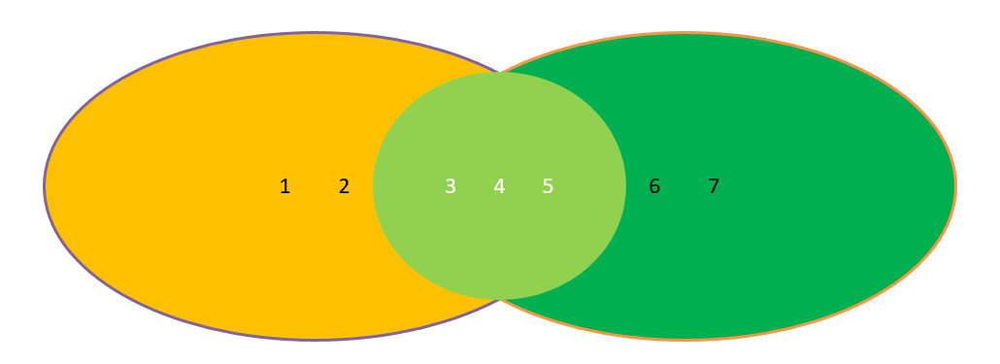
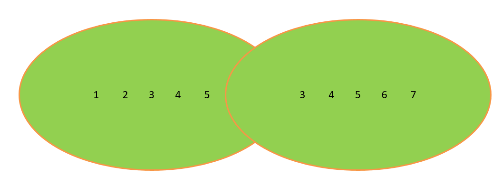
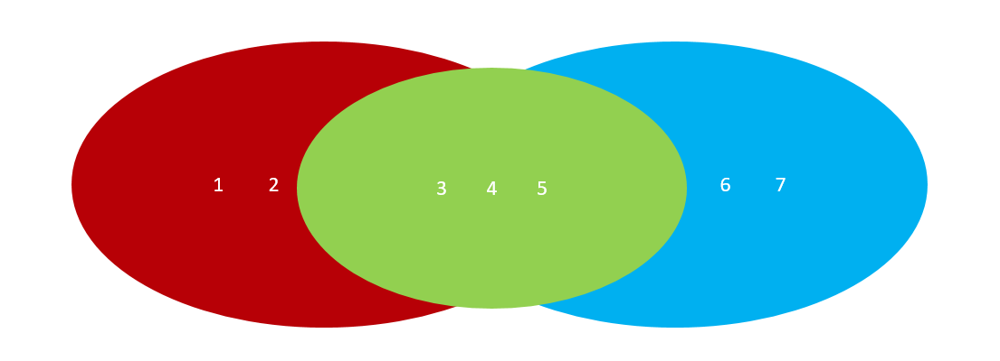

# Python中的数据序列

# 一、作业回顾

## 1、求幸运数字6

幸运数字6（只要是6的倍数）：输入任意数字，如数字8，生成nums列表，元素值为1~8，从中选取幸运数字移动到新列表lucky，打印nums与lucky。

```python
# 第一步：定义二个空列表
nums = []
lucky = []
# 第二步：提示用户输入数字
num = int(input('请输入您要输入的数字：'))
# 第三步：生成nums列表（把1到num）所有的数据都追加到nums列表中
for i in range(1, num+1):
    nums.append(i)
# 第四步：对nums进行遍历操作，获取幸运数字
for i in nums:
    if i % 6 == 0:
        # 幸运数字从nums中删除
        nums.remove(i)
        # 把幸运数字写入到lucky列表中
        lucky.append(i)
# 第五步：打印nums和lucky
print(nums)
print(lucky)
```

## 2、把8名讲师随机分配到3个教室

列表嵌套：有3个教室[[],[],[]]，8名讲师['A','B','C','D','E','F','G','H']，将8名讲师随机分配到3个教室中。

分析：

思考1：我们第一间教室、第二间教室、第三间教室，怎么表示

```python
rooms = [[],[],[]]
# 第一间教室
rooms[0]
# 第二间教室
rooms[1]
# 第三间教室
rooms[2]
```


思考2：我们如何一次从8名老师中，读出一个人

答：使用while或for进行遍历操作


思考3：我们如何在每次循环读取讲师的过程中，将其随机写入到某个教室？

```python
rooms[0或1或2] = 读取的讲师信息
```

综合代码：

```python
import random

# 1、定义3间教室以及8名讲师
rooms = [[], [], []]
teachers = ['A', 'B', 'C', 'D', 'E', 'F', 'G', 'H']
# 2、对所有的讲师进行遍历操作
for teacher in teachers:
    # 3、生成随机数
    index = random.randint(0, 2)
    rooms[index].append(teacher)
# 3、输出每个教室的讲师信息
# print(rooms)
i = 1
for room in rooms:
    print(f'第{i}个教室中的讲师：{room}')
    i += 1
```

## 3、知识点补充

字符串：split()方法

作用：根据指定字符对字符串进行分割操作，其返回一个列表

```python
fruit = 'apple-banana-orange'
print(fruit.split('-'))
```


字符串：join()方法

作用：和split()方法正好相反，其主要功能是把序列拼接为字符串

```python
字符串.join(数据序列)
```

案例：把水果列表['apple', 'banana', 'orange']拼接成'apple-banana-orange'

```python
list1 = ['apple', 'banana', 'orange']
print('-'.join(list1))
```

# 二、元组的定义与使用

## 1、为什么需要元组

思考：如果想要存储多个数据，但是这些数据是不能修改的数据，怎么做？

答：列表？列表可以一次性存储多个数据，但是列表中的数据允许更改。

```python
num_list = [10, 20, 30]
num_list[0] = 100
```


那这种情况下，我们想要存储多个数据且数据不允许更改，应该怎么办呢？

答：使用==元组，元组可以存储多个数据且元组内的数据是不能修改的。==

## 2、元组的定义

元组特点：定义元组使用==小括号==，且使用==逗号==隔开各个数据，==数据可以是不同的数据类型。==

基本语法：

```python
# 多个数据元组
tuple1 = (10, 20, 30)

# 单个数据元组
tuple2 = (10,)
```

> 注意：如果定义的元组只有一个数据，那么这个数据后面也要添加逗号，否则数据类型为唯一的这个数据的数据类型。

## 3、元组的相关操作方法

由于元组中的数据不允许直接修改，所以其操作方法大部分为查询方法。

| **编号** | **函数**   | **作用**                                                     |
| -------- | ---------- | ------------------------------------------------------------ |
| 1        | 元组[索引] | 根据==索引下标==查找元素                                     |
| 2        | index()    | 查找某个数据，如果数据存在返回对应的下标，否则报错，语法和列表、字符串的index方法相同 |
| 3        | count()    | 统计某个数据在当前元组出现的次数                             |
| 4        | len()      | 统计元组中数据的个数                                         |

案例1：访问元组中的某个元素

```python
nums = (10, 20, 30)
print(nums[2])
```

案例2：查找某个元素在元组中出现的位置，存在则返回索引下标，不存在则直接报错

```python
nums = (10, 20, 30)
print(nums.index(20))
```

案例3：统计某个元素在元组中出现的次数

```python
nums = (10, 20, 30, 50, 30)
print(nums.count(30))
```

案例4：len()方法主要就是求数据序列的长度，字符串、列表、元组

```python
nums = (10, 20, 30, 50, 30)
print(len(nums))
```

# 三、字典——Python中的查询神器

## 1、为什么需要字典

思考1：比如我们要存储一个人的信息，姓名：Tom，年龄：20周岁，性别：男，如何快速存储。

```python
person = ['Tom', '20', '男']
```

思考2：在日常生活中，姓名、年龄以及性别同属于一个人的基本特征。但是如果使用列表对其进行存储，则分散为3个元素，这显然不合逻辑。我们有没有办法，将其保存在同一个元素中，姓名、年龄以及性别都作为这个元素的3个属性。

答：使用Python中的字典

## 2、Python中字典(dict)的概念

 特点：

① 符号为==大括号==（花括号） =>  {}

② 数据为==键值对==形式出现   =>  {key:value}，key：键名，value：值，在同一个字典中，key必须是唯一（类似于索引下标）

③ 各个键值对之间用==逗号==隔开

定义：

```python
# 有数据字典
dict1 = {'name': 'Tom', 'age': 20, 'gender': '男'}

# 空字典
dict2 = {}

dict3 = dict()
```

## 3、字典的增操作

基本语法：

```python
字典名称[key] = value
注：如果key存在则修改这个key对应的值；如果key不存在则新增此键值对。
```

案例：定义一个空字典，然后添加name、age以及address这样的3个key

```python
# 1、定义一个空字典
person = {}
# 2、向字典中添加数据
person['name'] = '刘备'
person['age'] = 40
person['address'] = '蜀中'
# 3、使用print方法打印person字典
print(person)
```

> 注意：列表、字典为可变类型

## 4、字典的删操作

① del 字典名称[key]：删除指定元素

```python
# 1、定义一个有数据的字典
person = {'name':'王大锤', 'age':28, 'gender':'male', 'address':'北京市海淀区'}
# 2、删除字典中的某个元素（如gender）
del person['gender']
# 3、打印字典
print(person)
```

② clear()方法：清空字典中的所有key

```python
# 1、定义一个有数据的字典
person = {'name':'王大锤', 'age':28, 'gender':'male', 'address':'北京市海淀区'}
# 2、使用clear()方法清空字典
person.clear()
# 3、打印字典
print(person)
```

## 5、字典的改操作

基本语法：

```python
字典名称[key] = value
注：如果key存在则修改这个key对应的值；如果key不存在则新增此键值对。
```

案例：定义一个字典，里面有name、age以及address，修改address这个key的value值

```python
# 1、定义字典
person = {'name':'孙悟空', 'age': 600, 'address':'花果山'}
# 2、修改字典中的数据（address）
person['address'] = '东土大唐'
# 3、打印字典
print(person)
```

## 6、字典的查操作

① 查询方法：使用具体的某个key查询数据，如果未找到，则直接报错。

```python
字典序列[key]
```

② 字典的相关查询方法

| **编号** | **函数**         | **作用**                                                     |
| -------- | ---------------- | ------------------------------------------------------------ |
| 1        | get(key, 默认值) | 根据字典的key获取对应的value值，如果当前查找的key不存在则返回第二个参数(默认值)，如果省略第二个参数，则返回None |
| 2        | keys()           | 以列表返回一个字典所有的键                                   |
| 3        | values()         | 以列表返回字典中的所有值                                     |
| 4        | items()          | 以列表返回可遍历的(键, 值) 元组数组                          |

案例1：使用get获取字典中某个key的value值

```python
# 1、定义一个字典
cat = {'name':'Tom', 'age':5, 'address':'美国纽约'}
# 2、获取字典的相关信息
name = cat.get('name')
age = cat.get('age')
gender = cat.get('gender', 'male')  # get(key, 默认值)
address = cat.get('address')
print(f'姓名：{name}，年龄：{age}，性别：{gender}，住址：{address}')
```

案例2：提取person字典中的所有key

```python
# 1、定义一个字典
person = {'name':'貂蝉', 'age':18, 'mobile':'13765022249'}
# 2、提取字典中的name、age以及mobile属性
print(person.keys())
```

案例3：提取person字典中的所有value值

```python
# 1、定义一个字典
person = {'name':'貂蝉', 'age':18, 'mobile':'13765022249'}
# 2、提取字典中的貂蝉、18以及13765022249号码
print(person.values())
```

案例4：使用items()方法提取数据

```python
# 1、定义一个字典
person = {'name':'貂蝉', 'age':18, 'mobile':'13765022249'}
# 2、调用items方法获取数据，dict_items([('name', '貂蝉'), ('age', 18), ('mobile', '13765022249')])
# print(person.items())
# 3、结合for循环对字典中的数据进行遍历
for key, value in person.items():
    print(f'{key}：{value}')
```

## 7、综合案例：通讯录管理系统

需求：开个一个通讯录的管理系统，主要用于实现存储班级中同学的信息（姓名、年龄、电话）

知识点：列表、字典、死循环

延伸：在Python中，我们可以使用字典来保存一个人的基本信息。但是如果想保存多个人的信息，我们必须把列表和字典结合起来。

```python
students = [0,1,2]
student = {'name':'刘备', 'age':18, 'mobile': '10086'}

组装：

students = [{'name':'刘备', 'age':18, 'mobile': '10086'}, {'name':'关羽', 'age':17, 'mobile': '10000'}, {'name':'张飞', 'age':16, 'mobile': '10010'}]
```

为什么需要死循环：

当我们选中某个菜单时，功能一旦执行完毕，则整个程序就执行结束了。为了保存程序可以一直运行下去，可以模拟死循环的效果，让程序一直运行下去。

```python
while True:
    ...
```


要求：正常情况下，通讯录管理系统应该有4个功能：==增删==改查

```python
# 1、定义一个列表，将来用于存储所有学员的通讯信息
students = []

# 2、打印功能菜单
print('-' * 40)
print('欢迎使用传智教育通讯录管理系统V1.0')
print('[1] 增加学员信息')
print('[2] 删除学员信息')
print('[3] 退出系统')
print('-' * 40)

while True:
    # 3、提示用户进行相关操作
    user_num = int(input('请输入您要进行的操作编号：'))

    if user_num == 1:
        # 4、提示用户输入学员的信息
        student = {}
        student['name'] = input('请输入学员的姓名：')
        student['age'] = int(input('请输入学员的年龄：'))
        student['mobile'] = input('请输入学员的电话：')
        # 5、把学员信息保存在列表中
        students.append(student)
        print(students)

    elif user_num == 2:
        name = input('请输入要删除的学员信息：')
        # 6、遍历所有学员信息
        for i in students:
            if i['name'] == name:
                # 从列表中删除整个学员（字典）
                students.remove(i)
                print('删除成功')
                print(students)
            else:
                print('您要删除的学员信息不存在')

    elif user_num == 3:
        print('感谢您使用传智教育通讯录管理系统V1.0')
        break

    else:
        print('输入错误，请重新输入要操作的编号')
```

# 四、集合——求交集、并集、差集

## 1、什么是集合

集合（set）是一个无序的不重复元素序列。

① 天生去重

② 无序

## 2、集合的定义

在Python中，我们可以使用一对花括号{}或者set()方法来定义集合，但是如果你定义的集合是一个空集合，则只能使用set()方法。

```python
# 定义一个集合
s1 = {10, 20, 30, 40, 50}
print(s1)
print(type(s1))

# 定义一个集合：集合中存在相同的数据
s2 = {'刘备', '曹操', '孙权', '曹操'}
print(s2)
print(type(s1))

# 定义空集合
s3 = {}
s4 = set()
print(type(s3))	 # <class 'dict'>
print(type(s4))  # <class 'set'>
```

## 3、集合操作的相关方法（增删查）

### ☆ 集合的增操作

① add()方法：向集合中增加一个元素（单一）

```python
students = set()
students.add('李哲')
students.add('刘毅')
print(students)
```

② update()方法：向集合中增加序列类型的数据（字符串、列表、元组、字典）

```python
students = set()
list1 = ['刘备', '关羽', '赵云']
students.update(list1)
print(students)
```

```python
students = set()
students.add('刘德华')
students.add('黎明')
# 使用update新增元素
students.update('蔡徐坤')
```

### ☆ 集合的删操作

① remove()方法：删除集合中的指定数据，如果数据不存在则报错。

② discard()方法：删除集合中的指定数据，如果数据不存在也不会报错。

③ pop()方法：随机删除集合中的某个数据，并返回这个数据。

```python
# 1、定义一个集合
products = {'萝卜', '白菜', '水蜜桃', '奥利奥', '西红柿', '凤梨'}
# 2、使用remove方法删除白菜这个元素
products.remove('白菜')
print(products)
# 3、使用discard方法删除未知元素
products.discard('玉米')
print(products)
# 4、使用pop方法随机删除某个元素
del_product = products.pop()
print(del_product)
```

### ☆ 集合中的查操作

① in ：判断某个元素是否在集合中，如果在，则返回True，否则返回False

② not in ：判断某个元素不在集合中，如果不在，则返回True，否则返回False

```python
# 定义一个set集合
s1 = {'刘帅', '英标', '高源'}
# 判断刘帅是否在s1集合中
if '刘帅' in s1:
    print('刘帅在s1集合中')
else:
    print('刘帅没有出现在s1集合中')
```

③ 集合的遍历操作

```python
for i in 集合:
    print(i)
```

## 4、集合中的交集、并集与差集特性

在Python中，我们可以使用`&`来求两个集合的交集：



在Python中，我们可以使用`|`来求两个集合的并集：



在Python中，我们可以使用`-`来求两个集合的差集：



```python
# 求集合中的交集、并集、差集
s1 = {'刘备', '关羽', '张飞', '貂蝉'}
s2 = {'袁绍', '吕布', '曹操', '貂蝉'}

# 求两个集合中的交集
print(s1 & s2)

# 求两个集合中的并集
print(s1 | s2)

# 求连个集合中的差集
print(s1 - s2)
print(s2 - s1)
```

# 五、数据序列中的公共方法

## 1、什么是公共方法

所谓的公共方法就是支持大部分数据序列。

## 2、常见公共方法1

| **运算符** | **描述**       | **支持的容器类型**       |
| ---------- | -------------- | ------------------------ |
| +          | 合并           | 字符串、列表、元组       |
| *          | 复制           | 字符串、列表、元组       |
| in         | 元素是否存在   | 字符串、列表、元组、字典 |
| not  in    | 元素是否不存在 | 字符串、列表、元组、字典 |

 案例1：+ 合并

```python
# 1、+加号，代表两个序列之间的连接与整合
str1 = 'hello'
str2 = 'world'
print(str1 + str2)

# 2、定义两个列表，对其数据进行整合
list1 = ['刘备', '关羽']
list2 = ['诸葛亮', '赵云']
print(list1 + list2)

# 3、定义两个元组，对其数据进行整合
tuple1 = (10, 20)
tuple2 = (30, 40)
print(tuple1 + tuple2)
```

案例2：* 复制

```python
# 1、字符串与乘号的关系
print('-' * 40)
print('传智教育Python管理系统V1.0')
print('-' * 40)

# 2、列表与乘号的关系
list1 = ['*']
print(list1 * 10)

# 3、元组与乘号的关系
tuple1 = (10, )
print(tuple1 * 10)
```

案例3：in与not in方法

```python
ips = ['192.168.10.11', '10.1.1.100', '172.15.184.31']
if '10.1.1.100' in ips:
    print('列表中元素已存在')
else:
    print('列表中元素不存在')
```

## 3、常见公共方法2

| **编号** | **函数**                 | **描述**                                                     |
| -------- | ------------------------ | ------------------------------------------------------------ |
| 1        | len()                    | 计算容器中元素个数                                           |
| 2        | del或del()               | 根据索引下标删除指定元素                                     |
| 3        | max()                    | 返回容器中元素最大值                                         |
| 4        | min()                    | 返回容器中元素最小值                                         |
| 5        | range(start,  end, step) | 生成从start到end（不包含）的数字，步长为  step，供for循环使用 |
| 6        | enumerate()              | 函数用于将一个可遍历的数据对象(如列表、元组或字符串)组合为一个索引序列，同时列出数据和数据下标，一般用在  for  循环当中。 |

案例1：len() 获取字符串、列表、元组、字典、集合的长度

```python
# 定义一个字符串
str1 = 'hello world'
print(f'字符串的长度为{len(str1)}')

# 定义一个列表
list1 = [10, 20, 30, 40, 50]
print(f'列表的长度为{len(list1)}')

# 定义一个字典
dict1 = {'name':'哆啦A梦', 'gender':'male', 'address':'东京'}
print(f'字典的长度为{len(dict1)}')
```

案例2：del方法，用于删除序列中指定的元素（根据索引下标）

```python
# 定义一个列表
list1 = ['吕布', '董卓', '貂蝉']
# 使用del方法删除董卓
del list1[1]
print(list1)


# 定义一个字典
dict1 = {'name':'白龙马', 'age':23, 'address':'东海龙宫'}
# 使用del方法删除age
del dict1['age']
print(dict1)
```

案例3：求某个序列中元素的最大值和最小值

```python
num1 = int(input('请输入第一个数：'))
num2 = int(input('请输入第二个数：'))
num3 = int(input('请输入第三个数：'))
list1 = [num1, num2, num3]
max_num = max(list1)
min_num = min(list1)
print(f'最大值：{max_num}')
print(f'最小值：{min_num}')
```

案例4：enumerate()，把一个序列类型的数据构造成key:value结构，然后结合for循环进行遍历

```python
list1 = [10, 20, 30, 40, 50]
n = 1
for i in list1:
    print(f'第{n}个数：{i}')
    n += 1

print('-' * 40)

for key, value in enumerate(list1):
    print(f'第{key+1}个数：{value}')
```

## 4、序列类型之间的相互转换

list()方法：把某个序列类型的数据转化为列表

```python
# 1、定义元组类型的序列
tuple1 = (10, 20, 30)
print(list(tuple1))

# 2、定义一个集合类型的序列
set1 = {'a', 'b', 'c', 'd'}
print(list(set1))

# 3、定义一个字典
dict1 = {'name':'刘备', 'age':18, 'address':'蜀中'}
print(list(dict1))
```

tuple()方法：把某个序列类型的数据转化为元组

```python
# 定义一个列表类型的数据
list1 = ['a', 'b', 'c', 'd']
print(tuple(list1))

# 定义一个集合类型的数据
set1 = {10, 20, 30, 40}
print(tuple(set1))
```

set()方法：将某个序列转换成集合（但是要注意两件事 => ① 集合可以快速完成列表去重 ② 集合不支持下标）

```python
# 定义一个列表类型的数据
list1 = ['a', 'b', 'c', 'd', 'a']
print(set(list1))
# 定义一个元组类型的数据
tuple1 = (10, 20, 30, 40)
print(set(tuple1))
```

# 六、列表集合字典推导式

## 1、什么是推导式

推导式comprehensions（又称解析式），是Python的一种独有特性。推导式是可以从一个数据序列构建另一个新的数据序列（一个有规律的列表或控制一个有规律列表）的结构体。 共有三种推导：`列表推导式`、`集合推导式`、`字典推导式`。

[1, 2, 3]      推导式     [1, 4, 9]

## 2、为什么需要推导式

案例：创建一个0-9的列表

while循环：

```python
# 初始化计数器
i = 0
list1 = []
# 编写循环条件
while i <= 9:
    list1.append(i)
 	# 更新计数器
    i += 1
print(list1)
```

for循环：

```python
list1 = []
# 编写for循环
for i in range(0, 10):
    list1.append(i)
print(list1)
```

思考：我们能不能把以上代码简化为一行代码搞定这个程序呢？

答：可以，使用推导式

## 3、列表推导式

基本语法：

```python
变量名 = [表达式 for 变量 in 列表 for 变量 in 列表]
变量名 = [表达式 for 变量 in 列表 if 条件]
```

案例：定义0-9之间的列表

```python
list1 = []
for i in range(10):
    list1.append(i)
print(list1)
```

列表推导式

```python
list1 = [i for i in range(10)]
print(list1)
```

执行原理：[i for i in range(10)]

```powershell
列表推导式先运行表达式右边的内容：

当第一次遍历时：i = 0，其得到变量i的结果后，会放入最左侧的变量i中，这个时候列表中就是[0]
当第二次遍历时：i = 1，其得到变量i的结果后，会追加最左侧的变量i中，这个时候列表中就是[0, 1]
...
当最后一次遍历时：i = 9，其得到变量i的结果后，会追加最左侧的变量i中，这个时候列表中就是[0, 1, 2, 3, 4, 5, 6, 7, 8, 9]
```

## 4、列表推导式 + if条件判断

在使用列表推导式时候，我们除了可以使用for循环，其实我们还可以在其遍历的过程中，引入if条件判断。

```python
变量 = [表达式 for 临时变量 in 序列 if 条件判断]

等价于

for 临时变量 in 序列:
    if 条件判断
```

案例：生成0-9之间的偶数（i%2 == 0）序列

```python
list1 = [i for i in range(10) if i % 2 == 0]
print(list1)
```

## 5、for循环嵌套列表推导式

```python
for 临时变量 in range(n):
    for 临时变量 in range(n):
```

基本语法：

```python
变量 = [表达式 for 临时变量 in 序列 for 临时变量 in 序列]
```

案例：创建列表 => [(1, 0), (1, 1), (1, 2), (2, 0), (2, 1), (2, 2)]

(1,0)    (1, 0-2)

(1,1)    (1, 0-2)

(1,2)    (1, 0-2)

-------------------

(2,0)    (2, 0-2)

(2,1)    (2, 0-2)

(2,2)    (2, 0-2)

原生代码：for循环嵌套

```python
list1 = []
# 外层循环
for i in range(1, 3):
    # 内层循环
    for j in range(0, 3):
        tuple1 = (i, j)
        list1.append(tuple1)
print(list1)
```

列表推导式：

```python
list1 = [(i, j) for i in range(1, 3) for j in range(0, 3)]
print(list1)
```

## 6、字典推导式

思考：有如下两个列表，如何快速合并为一个字典？

```python
list1 = ['name', 'age', 'gender']
list2 = ['Tom', 20, 'male']

person = {'name':'Tom', 'age':20, 'gender':'male'}
```


答：使用字典推导式

基本语法：

① 字典推导式列表推导式思想的延续，语法差不多，只不过产生的是字典而已。

② 字典推导式格式：

```python
变量 = {key:value for key,value in 序列}
```

字典推导式作用：==快速合并列表为字典或提取字典中目标数据。==


案例1：创建一个字典：字典key是1-5数字，value是这个数字的2次方。

dict1 = {1:1, 2:4, 3:9, 4:16, 5:25}

```python
dict1 = {i:i**2 for i in range(1,6)}
print(dict1)
```


案例2：把两个列表合并为一个字典

```python
list1 = ['name', 'age', 'gender']
list2 = ['Tom', 20, 'male']
# 结果：person = {'name':'Tom', 'age':20, 'gender':'male'}

person = {list1[i]:list2[i] for i in range(len(list1))}
print(person)
```


案例3：提取字典中目标数据

```python
counts = {'MBP': 268, 'HP': 125, 'DELL': 201, 'Lenovo': 199, 'ACER': 99}

# 需求：提取上述电脑数量大于等于200的字典数据
counts = {key:value for key, value in counts.items() if value >= 200}
print(counts)
```

## 7、集合推导式

集合推导式跟列表推导式非常相似，唯一区别在于用 { } 代替 [ ]。

思考：为什么需要集合推导式，列表推导式不香么？

答：集合的最大特点就是去重


需求：创建一个集合，数据为下方列表的2次方。

```python
list1 = [1, 1, 2]
set1 = {1, 4}
```

推导式

```python
list1 = [1, 1, 2]
set1 = {i**2 for i in list1}
print(set1)
```

# 七、作业

## 1、编写通讯录管理系统

必须手工完成编写，只需要实现增加、删除、退出功能

## 2、使用xmind把今天内容做一个总结

截图


