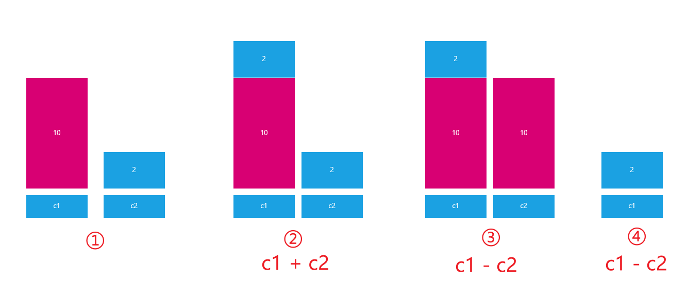

# Python中的函数

# 一、作业回顾

需求：编写一段Python代码，生成一个随机的4位验证码

提前：定义一个字符串

```python
str1 = "23456789abcdefghijkmnpqrstuvwxyzABCDEFGHJKLMNPQRSTUVWXYZ"
```

编写Python代码：

① 思考：如果只生成4个字符的验证码，如何只保证从字符串中读取4次（while循环、for循环）

② 思考：如果随机的从str1字符串中读取4个字符？random.randint()生成随机数

③ 思考：如果从字符串提取出某个字符？答：使用索引下标，str1[索引下标]

```python
import random


# 1、定义一个字符串
str1 = "23456789abcdefghijkmnpqrstuvwxyzABCDEFGHJKLMNPQRSTUVWXYZ"
code = ""
# 2、编写循环，只循环4次
for i in range(4):   # 0 1 2 3
    # 3、随机获取str1中的某个字符
    index = random.randint(0, len(str1) - 1)
    code += str1[index]
# 4、打印4位随机验证码
print(code)
```

# 二、Python中函数的作用与使用步骤

## 1、为什么需要函数

在Python实际开发中，我们使用函数的目的只有一个“让我们的代码可以被重复使用”

函数的作用有两个：

① 模块化编程

② 代码重用

> 在编程领域，编程可以分为两大类：① 模块化编程 ② 面向对象编程

## 2、什么是函数

所谓的函数就是一个==被命名的==、==独立的、完成特定功能的代码段（一段连续的代码）==，并可能给调用它的程序一个==返回值==。


被命名的：在Python中，函数大多数是有名函数。当然Python中也存在没有名字的函数叫做匿名函数。

独立的、完成特定功能的代码段：在实际项目开发中，定义函数前一定要先思考一下，这个函数是为了完成某个操作或某个功能而定义的。（函数的功能一定要专一）

返回值：很多函数在执行完毕后，会通过return关键字返回一个结果给调用它的位置。

## 3、函数的定义

基本语法：

```python
def 函数名称([参数1, 参数2, ...]):
    函数体
    ...
    [return 返回值]
```

## 4、函数的调用

在Python中，函数和变量一样，都是先定义后使用。

```python
# 定义函数
def 函数名称([参数1, 参数2, ...]):
    函数体
    ...
    [return 返回值]

# 调用函数
函数名称(参数1, 参数2, ...)
```

## 5、通过一个栗子引入函数

① 使用Python代码，编写一个打招呼程序

```python
第一步：见到一个老师，打一声招呼
print('您好')
第二步：见到一个老师，打一声招呼
print('您好')
第二步：见到一个老师，打一声招呼
print('您好')
```

虽然以上程序可以满足程序的需求，但是我们发现，我们的代码做了很多重复性的工作。我们能不能对以上代码进行进一步的优化，避免代码的重复性编写。

② 升级：使用Python代码，编写一个打招呼程序（函数——一次编写，多次利用）

```python
# 定义函数（封装函数）
def greet():
    print('您好')

# 调用函数
# 见到一个老师，打一声招呼
greet()
# 见到一个老师，打一声招呼
greet()
# 见到一个老师，打一声招呼
greet()
```

③ 升级：使用Python代码编写一个打招呼程序，可以实现向不同的人打不同的招呼

```python
# 定义一个函数，同时为其定义一个参数
def greet(name):
    print(f'{name}，您好')

# 调用函数
# 见到了张老师，打一声招呼
greet('老张')
# 见到了李老师，打一声招呼
greet('老李')
# 见到了王老师，打一声招呼
greet('老王')
```

④ 函数的设计原则“高内聚、低耦合”，函数执行完毕后，应该主动把数返回给调用处，而不应该都交由print()等函数直接输出。

```python
# 定义一个函数，拥有name参数，同时函数执行完毕后，拥有一个return返回值
def greet(name):
    # 执行一系列相关操作
    return name + '，您好'

# 调用函数
# 见到了张老师，打一声招呼
print(greet('老张'))  # 老张，您好
# 见到了李老师，打一声招呼
print("\033[0;31;40m\t" + greet('老李') + "\033[0m")
# 见到了王老师，打一声招呼
print("\033[0;36;40m\t" + greet('老王') + "\033[0m")
```

> 终端颜色参考：https://www.cnblogs.com/zhuminghui/p/9457185.html

## 6、聊聊return返回值

思考1：如果一个函数如些两个return (如下所示)，程序如何执行？

```python
def return_num():
    return 1
    return 2


result = return_num()
print(result)  # 1
```

答：只执行了第一个return，原因是因为return可以退出当前函数，导致return下方的代码不执行。


思考2：如果一个函数要有多个返回值，该如何书写代码？

答：在Python中，理论上一个函数只能返回一个结果。但是如果我们向让一个函数可以同时返回多个结果，我们可以使用`return 元组`的形式。

```python
def return_num():
    return 1, 2


result = return_num()
print(result)
print(type(result))  # <class 'tuple'>
```


思考3：封装一个函数，参数有两个num1，num2，求两个数的四则运算结果

四则运算：加、减、乘、除

```python
def size(num1, num2):
    jia = num1 + num2
    jian = num1 - num2
    cheng = num1 * num2
    chu = num1 / num2
    return jia, jian, cheng, chu


# 调用size方法
print(size(20, 5))
```

# 三、Python函数中的说明文档

## 1、什么是说明文档

思考：定义一个函数后，程序员如何书写程序能够快速提示这个函数的作用？

答：注释


思考：如果代码多，我们是不是需要在很多代码中找到这个函数定义的位置才能看到注释？如果想更方便的查看函数的作用怎么办？

答：==函数的说明文档（函数的说明文档也叫函数的文档说明）==

## 2、定义函数的说明文档

① 定义函数的说明文档

```python
# 1、定义一个menu菜单函数
def menu():
    pass

# 2、定义通讯录增加操作方法
def add_student():
    """ 函数的说明文档：add_student方法不需要传递任何参数，其功能就是实现对通讯录的增加操作 """
    pass

# 3、定义通讯录删除操作方法
def del_student():
    pass

# 4、定义通讯录修改操作方法
def modify_student():
    pass

# 5、定义通讯录查询操作方法
def find_student():
    pass
```

② 调用函数的说明文档

```python
help(函数名称)
```

案例：调用add_student()方法

```python
help(add_student)
```

运行结果：


## 3、封装一个函数，用于生成指定长度的验证码

```python
# 定义一个generate_code()函数
def generate_code(num):
    """ generate_code方法主要用于生成指定长度的验证码，有一个num参数，需要传递一个int类型的数值，其return返回结果为num长度的随机验证码 """
    import random
    # 第一步：定义一个字符串
    str1 = "23456789abcdefghijkmnpqrstuvwxyzABCDEFGHJKLMNPQRSTUVWXYZ"
    # 第二步：循环num次，代表生成num长度的字符串
    code = ''
    for i in range(num):
        # 第三步：从字符串中随机抽取num个字符
        index = random.randint(0, len(str1) - 1)
        code += str1[index]
    # 第四步：使用return返回验证码
    return code

# 求帮助（查看generate_code函数的作用以及需要传递的参数）
# help(generate_code)

# 调用函数
print(generate_code(6))
```

# 四、函数的嵌套

## 1、什么是函数的嵌套

所谓函数嵌套调用指的是==一个函数里面又调用了另外一个函数==。

## 2、函数嵌套的基本语法


嵌套函数的执行流程：

第一步：Python代码遵循一个“顺序原则”，从上往下，从左往右一行一行执行

当代码执行到第1行时，则在计算机内存中定义一个funcB函数。但是其内部的代码并没有真正的执行，跳过第2行继续向下运行。

第二步：执行到第5行，发现又声明了一个funcA的函数，根据函数的定义原则，定义就是在内存中声明有这样一个函数，但是没有真正的调用和执行。

第三步：代码继续向下执行，到第14行，发现funcA()，函数体()就代表调用funcA函数并执行其内部的代码。程序返回到第6行，然后一步一步向下执行，输出40个横杠，然后打印这是funcA函数的函数体部分...，然后继续向下执行，遇到funcB函数，后边有一个圆括号代表执行funcB函数，原程序处于等待状态。

第四步：进入funcB函数，执行输出这是funcB函数的函数体部分...，当代码完毕后，返回funcA函数中funcB()的位置，继续向下执行，打印40个横杠。

最终程序就执行结束了。

## 3、PyCharm调试小技巧

Step over（F8）：代码一步一步向下执行，但是遇到了函数以后，不进入函数体内部，直接返回函数的最终的执行结果。

Step into（F7）：代码一步一步向下执行，但是遇到了函数以后，进入到函数体内部，一步一步向下执行，直到函数体的代码全部执行完毕。


## 4、通过一个案例描述函数嵌套

百度百科，搜索Python语言词条


嵌套函数funcB和funcC


在funcA函数执行过程中，如果遇到了funcB则跳入funcB函数继续执行，当funcB执行完毕后，会自动返回funcA函数，继续向下运行，依次类推，直到funcA函数执行完毕。

# 五、函数的应用案例

案例1：使用print方法打印一条横线

```python
print('-' * 40)
```

案例2：对案例1进行升级，可以根据输入的num数值，生成指定数量的横线

```python
def print_lines(num, length):
    """ print_lines函数主要作用用于生成多条指定长度的横线，拥有两个参数num和length，都是int整型数据，num用于控制生成的横线数量，length用于控制生成横线的长度 """
    for i in range(num):
        print('-' * length)
        
# 调用函数
# help(print_lines)
print_lines(4, 40)
```

案例3：封装一个函数，用于求3个数的平均值

```python
def average_num(num1, num2, num3):
    """ average_num函数主要用于生成3个数的平均值，一共有3个参数，num1、num2、num3，要求是整型或浮点类型的数据，其返回结果就是三个数的平均值 """
    sum = num1 + num2 + num3
    # 求平均值
    return sum/3

# 调用average_num方法
# help(average_num)
print(average_num(10, 20, 30))
```

练习题：编写一个函数，有一个参数str1，输入信息如'1.2.3.4.5'，使用函数对齐进行处理，要求最终的返回结果为'5-4-3-2-1'

```python
def func(str1):
    # 方法一：对字符串进行翻转操作(切片)
    str1 = str1[::-1]
    return str1.replace('.', '-')
    # 方法二：使用split切割，然后reverse进行翻转
    # list1 = str1.split('.')
    # list1.reverse()
    # return '-'.join(list1)


# 调用函数实现字符串翻转拼接
str1 = '1.2.3.4.5'
print(func(str1))  # 5-4-3-2-1
```

# 六、变量的作用域

## 1、什么是变量的作用域

变量作用域指的是变量的作用范围（变量在哪里可用，在哪里不可用），主要分为两类：局部变量和全局变量。

## 2、局部变量与全局变量

在Python中，定义在函数外部的变量就称之为全局变量；定义在函数内部变量就称之为局部变量。

```python
# 定义在函数外部的变量（全局变量）
num = 10
# 定义一个函数
def func():
    # 函数体代码
    # 定义在函数内部的变量（局部变量）
    i = 1
```

## 3、变量作用域的作用范围

全局变量：在整个程序范围内都可以直接使用

```python
str1 = 'hello'
# 定义一个函数
def func():
    # 在函数内部调用全局变量str1
    print(f'在局部作用域中调用str1变量：{str1}')

# 直接调用全局变量str1
print(f'在全局作用域中调用str1变量：{str1}')
# 调用func函数
func()
```

局部变量：在函数的调用过程中，开始定义，函数运行过程中生效，函数执行完毕后，销毁

```python
# 定义一个函数
def func():
    # 在函数内部定义一个局部变量
    num = 10
    print(f'在局部作用域中调用num局部变量：{num}')

# 调用func函数
func()
# 在全局作用域中调用num局部变量
print(f'在全局作用域中调用num局部变量：{num}')
```

运行结果：


> 普及小知识：计算机的垃圾回收机制

## 4、global关键字

思考：如果有一个数据，在函数A和函数B中都要使用，该怎么办？

答：将这个数据存储在一个全局变量里面。

案例：如果把通讯录管理系统更改为模块化编程模式（程序 => 函数），面临问题：

```python
# 定义全局变量
info = []

# 定义funcA函数
def funcA():
    # 使用global声明全局变量
    global info
    # 向info全局变量中添加数据
    info.append({...})
    
# 定义funcB函数
def funcB():
    # 共享全局作用域中的全局变量info
    for i in info:
        ...
```

这个会产生一个问题：我们能不能在局部作用域中对全局变量进行修改呢？

```python
# 定义全局变量num = 10
num = 10
# 定义一个函数func
def func():
    # 尝试在局部作用域中修改全局变量
    num = 20

# 调用函数func
func()
# 尝试访问全局变量num
print(num)
```

最终结果：弹出10，所以由运行结果可知，在函数体内部理论上是没有办法对全局变量进行修改的，所以一定要进行修改，必须使用`global`关键字。

```python
# 定义全局变量num = 10
num = 10
# 定义一个函数func
def func():
    # 尝试在局部作用域中修改全局变量
    global num
    num = 20

# 调用函数func
func()
# 尝试访问全局变量num
print(num)
```

## 5、多函数之间数据的共享

```python
# 定义全局变量
info = []

# 定义funcA函数:向全局变量中添加信息
def funcA():
    # 使用global声明全局变量
    global info
    # 向info全局变量中添加数据
    info.append({...})
    
# 定义funcB函数:查询功能，需要共享全局作用域中的通讯录信息
def funcB():
    # 共享全局作用域中的全局变量info
    for i in info:
        ...
```

## 6、把函数的返回值作为另外一个函数的参数

```python
def test1():
    return 50

def test2(num):
    print(num)

# 1. 保存函数test1的返回值
result = test1()

# 2.将函数返回值所在变量作为参数传递到test2函数
test2(result)  # 50
```

# 七、函数的参数进阶

## 1、函数的参数

在函数定义与调用时，我们可以根据自己的需求来实现参数的传递。在Python中，函数的参数一共有两种形式：① 形参 ② 实参

==形参：在函数定义时，所编写的参数就称之为形式参数==

==实参：在函数调用时，所传递的参数就称之为实际参数==

```python
def greet(name):  # name就是在函数greet定义时，所编写的参数（形参）
    return name + '，您好'

# 调用函数
name = '老王'
greet(name)  # 在函数调用时，所传递的参数就是实际参数
```

> 注意：虽然我们在函数传递时，喜欢使用相同的名称作为参数名称。但是两者的作用范围是不同的。name = '老王'，代表实参。其是一个全局变量，而greet(name)函数中的name实际是在函数定义时才声明的变量，所以其实一个局部变量。

## 2、函数的参数类型

###  ☆ 位置参数

理论上，在函数定义时，我们可以为其定义多个参数。但是在函数调用时，我们也应该传递多个参数，正常情况，其要一一对应。

```python
def user_info(name, age, address):
    print(f'我的名字{name}，今年{age}岁了，家里住在{address}')
    
# 调用函数
user_info('Tom', 23, '美国纽约')
```

> 注意事项：位置参数强调的是参数传递的位置必须一一对应，不能颠倒

### ☆ 关键词参数（Python特有）

函数调用，通过“键=值”形式加以指定。可以让函数更加清晰、容易使用，同时也清除了参数的顺序需求。

```python
def user_info(name, age, address):
    print(f'我的名字{name}，今年{age}岁了，家里住在{address}')
    
# 调用函数（使用关键词参数）
user_info(name='Tom', age=23, address='美国纽约')
```

## 3、函数定义时缺省参数（参数默认值）

缺省参数也叫默认参数，用于定义函数，为参数提供默认值，调用函数时可不传该默认参数的值（注意：所有位置参数必须出现在默认参数前，包括函数定义和调用）。

```python
def user_info(name, age, gender='男'):
    print(f'我的名字{name}，今年{age}岁了，我的性别为{gender}')


user_info('李林', 25)
user_info('振华', 28)
user_info('婉儿', 18, '女')
```

> 谨记：我们在定义缺省参数时，一定要把其写在参数列表的最后侧

## 4、不定长参数

不定长参数也叫可变参数。用于不确定调用的时候会传递多少个参数(不传参也可以)的场景。此时，可用==包裹(packing)位置参数==，或者==包裹关键字参数==，来进行参数传递，会显得非常方便。

### ☆ 包裹(packing)位置参数

````python
def user_info(*args):
    # print(args)  # 元组类型数据，对传递参数有顺序要求
    print(f'我的名字{args[0]}，今年{args[1]}岁了，住在{args[2]}')

# 调用函数，传递参数
user_info('Tom', 23, '美国纽约')
````

### ☆ 包裹关键字参数

```python
def user_info(**kwargs):
    # print(kwargs)  # 字典类型数据，对传递参数没有顺序要求，格式要求key = value值
    print(f'我的名字{kwargs["name"]}，今年{kwargs["age"]}岁了，住在{kwargs["address"]}')

# 调用函数，传递参数
user_info(name='Tom', address='美国纽约', age=23)
```

> kw = keyword + args

综上：无论是包裹位置传递还是包裹关键字传递，都是一个组包的过程。

Python组包：就是把多个数据组成元组或者字典的过程。

# 八、Python拆包（元组和字典）

## 1、什么是拆包

Python拆包：就是把元组或字典中的数据单独的拆分出来，然后赋予给其他的变量。

拆包: 对于函数中的多个返回数据, 去掉元组, 列表 或者字典直接获取里面数据的过程。

## 2、元组的拆包过程

```python
def func():
    # 经过一系列操作返回一个元组
    return 100, 200	 # tuple元组类型的数据

# 定义两个变量接收元组中的每个数组（拆包）
num1, num2 = func()
# 打印num1和num2
print(num1)
print(num2)
```

## 3、字典的拆包过程

记住：字典拆包，只能把每个元素的key拆出来

```python
dict1 = {'name':'小明', 'age':18}
# 拆包的过程（字典）
a, b = dict1
print(a)
print(b)
# 获取字典中的数据
print(dict1[a])
print(dict1[b])
```

## 4、拆包的应用案例

案例1：使用至少`3种方式`交换两个变量的值

第一种方式：引入一个临时变量

```python
c1 = 10
c2 = 2

# 引入临时变量temp
temp = c2
c2 = c1
c1 = temp

print(c1, c2)
```

第二种方式：使用加法与减法运算交换两个变量的值（不需要引入临时变量）

```python
c1 = 10
c2 = 2

c1 = c1 + c2
c2 = c1 - c2
c1 = c1 - c2

print(c1, c2)
```



第三种方法：只有Python才具有的特性，叫做拆包

```python
c1 = 10
c2 = 2

c1, c2 = c2, c1
```

原理：

第一步：把c2和c1组成一个元组（c2，c1）

第二步：使用拆包特性，把元组中的两个元素分别赋值给c1和c2


案例2：Python中数据的传递案例

```python
def func(*args, **kwargs):
    print(args)
    print(kwargs)


# 定义一个元组（也可以是列表）
tuple1 = (10, 20, 30)
# 定义一个字典
dict1 = {'first': 40, 'second': 50, 'third': 60}
# 需求：把元组传递给*args参数，字典传递给**kwargs
# ① 如果想把元组传递给*args，必须在tuple1的前面加一个*号
# ② 如果想把字典传递给**kwargs，必须在dict1的前面加两个**号
func(*tuple1, **dict1)
```

# 九、使用Python函数编写通讯录系统

## 1、查看通讯录系统最终效果


## 2、需求分析

需求：进入系统显示系统功能界面，功能如下：

① 添加学员信息

② 删除学员信息

③ 修改学员信息

④ 查询学员信息

⑤ 遍历所有学员信息

⑥ 退出系统

系统共6个功能，用户根据自己需求选取

## 3、功能实现步骤

① 显示功能界面

② 用户输入功能序号

③ 根据用户输入的功能序号，执行不同的功能(函数)

☆ 定义函数

☆ 调用函数

## 4、模块化的编程思想

模块化的编程思想是最早期的编程思想，其强调把一个系统分解为若干个功能，每个功能就是一个模块（函数）。当所有功能开发完毕后，则系统就完成了。

## 5、使用Python开发通讯录管理系统

① 显示功能界面

② 提示用户输入要操作的功能编号

③ 根据用户输入的序号执行相关功能 => if...elif...else

④ 如何让程序一直执行下去，而不是选择某个功能后，程序就退出了 => while True

⑤ 根据用户输入的序号，完成系统中的每一个功能

所有功能都有使用前提：必须共享一套数据 => info = [{}, {}, {}]

☆ 学员信息添加功能（add_student()）

