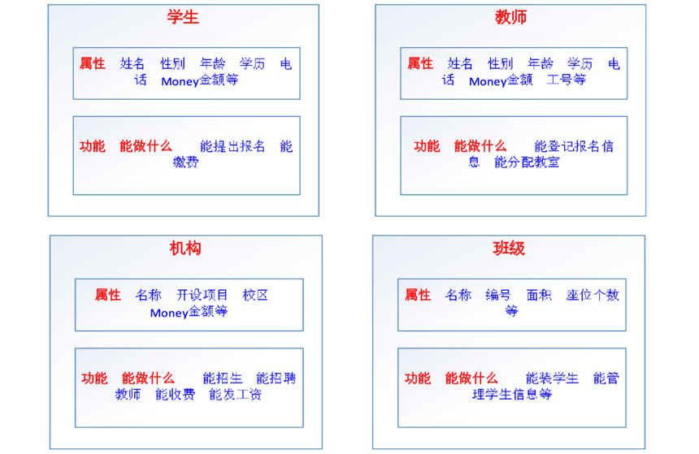
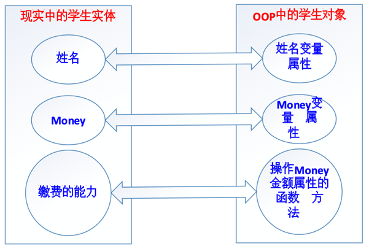
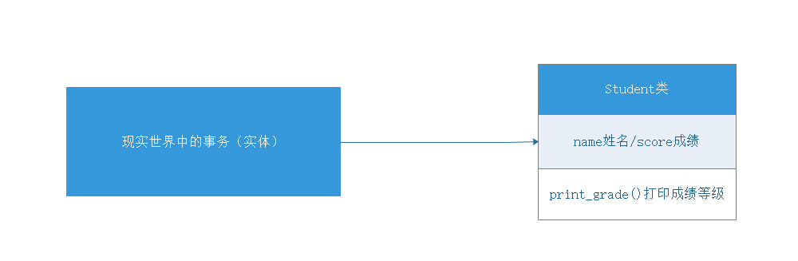
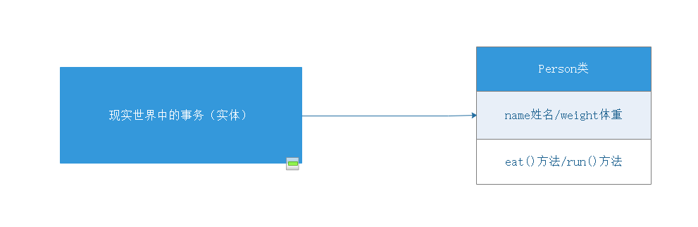

# Python文件操作与面向对象

# 一、文件备份案例

## 1、实例代码

```python
# 1、接收用户输入的文件名（要备份的文件名）
oldname = input('请输入要备份的文件名称：')  # python.txt
# 2、规划备份文件名（python[备份].txt）
# 搜索点号
index = oldname.rfind('.')
# 返回文件名和文件后缀
name = oldname[:index]
postfix = oldname[index:]
newname = name + '[备份]' + postfix
# 3、对文件进行备份操作
old_f = open(oldname, 'rb')
new_f = open(newname, 'wb')

# 读取源文件内容写入新文件
while True:
    content = old_f.read(1024)
    if len(content) == 0:
        break
    new_f.write(content)
# 4、关闭文件
old_f.close()
new_f.close()
```

## 2、查漏补缺

遗留问题：我们要备份的文件名称都是由用户通过input方法输入而来的，但是一定要记住，只要在程序中有人为输入，强烈建议对用户输入的数据进行校检。

> 所有用户的输入都是不靠谱的！

解决用户输入文件名称异常问题：

```python
# 1、接收用户输入的文件名（要备份的文件名）
oldname = input('请输入要备份的文件名称：')  # python.txt
# 2、规划备份文件名（python[备份].txt）
# 搜索点号
index = oldname.rfind('.')
# 对index进行判断，判断是否合理（index > 0)
if index > 0:
    # 返回文件名和文件后缀
    name = oldname[:index]
    postfix = oldname[index:]
    newname = name + '[备份]' + postfix
    # 3、对文件进行备份操作
    old_f = open(oldname, 'rb')
    new_f = open(newname, 'wb')

    # 读取源文件内容写入新文件
    while True:
        content = old_f.read(1024)
        if len(content) == 0:
            break
        new_f.write(content)
    # 4、关闭文件
    old_f.close()
    new_f.close()
else:
    print('请输入正确的文件名称，否则无法进行备份操作...')
```

# 二、文件和文件夹操作

## 1、os模块

在Python中文件和文件夹的操作要借助os模块里面的相关功能，具体步骤如下：

第一步：导入os模块

```python
import os
```

第二步：调用os模块中的相关方法

```python
os.函数名()
```

## 2、与文件操作相关方法

| **编号** | **函数**                            | **功能**             |
| -------- | ----------------------------------- | -------------------- |
| 1        | os.rename(目标文件名称，新文件名称) | 对文件进行重命名操作 |
| 2        | os.remove(要删除文件名称)           | 对文件进行删除操作   |

案例：把Python项目目录下的python.txt文件，更名为linux.txt，休眠20s，刷新后，查看效果，然后对这个文件进行删除操作。

```python
# 第一步：导入os模块
import os
# 第三步：引入time模块
import time


# 第二步：使用os.rename方法对python.txt进行重命名
os.rename('python.txt', 'linux.txt')

# 第四步：休眠20s
time.sleep(20)

# 第五步：删除文件（linux.txt)
os.remove('linux.txt')
```

## 3、与文件夹操作相关操作

前提：

```python
import os
```

相关方法：

| **编号** | **函数**                 | **功能**                                   |
| -------- | ------------------------ | ------------------------------------------ |
| 1        | os.mkdir(新文件夹名称)   | 创建一个指定名称的文件夹                   |
| 2        | os.getcwd()              | current work   directory，获取当前目录名称 |
| 3        | os.chdir(切换后目录名称) | change  directory，切换目录                |
| 4        | os.listdir(目标目录)     | 获取指定目录下的文件信息，返回列表         |
| 5        | os.rmdir(目标目录)       | 用于删除一个指定名称的"空"文件夹           |

案例1：

```python
# 导入os模块
import os


# 1、使用mkdir方法创建一个images文件夹
# os.mkdir('images')
# os.mkdir('images/avatar')

# 2、getcwd = get current work directory
print(os.getcwd())

# 3、os.chdir，ch = change dir = directory切换目录
os.chdir('images/avatar')
print(os.getcwd())

# 切换到上一级目录 => images
os.chdir('../../')
print(os.getcwd())

# 4、使用os.listdir打印当前所在目录下的所有文件，返回列表
print(os.listdir())

# 5、删除空目录
os.rmdir('images/avatar')
```

案例2：准备一个static文件夹以及file1.txt、file2.txt、file3.txt三个文件

① 在程序中，将当前目录切换到static文件夹

② 创建一个新images文件夹以及test文件夹

③ 获取目录下的所有文件

④ 移除test文件夹

```python
# 导入os模块
import os


# ① 在程序中，将当前目录切换到static文件夹
os.chdir('static')
# print(os.getcwd())

# ② 创建一个新images文件夹以及test文件夹
# os.mkdir('images')
# os.mkdir('test')

# ③ 获取目录下的所有文件
# print(os.listdir())
for file in os.listdir():
    print(file)

# ④ 移除test文件夹
os.rmdir('test')
```

## 4、文件夹删除补充（递归删除、慎重！）

```python
# 导入shutil模块
import shutil

# 递归删除非空目录
shutil.rmtree('要删除文件夹路径')
```

> 递归删除文件夹的原理：理论上，其在删除过程中，如果文件夹非空，则自动切换到文件夹的内部，然后把其内部的文件，一个一个删除，当所有文件删除完毕后，返回到上一级目录，删除文件夹本身。

## 5、普及路径的小知识

绝对路径：

```python
D:\PycharmProjects\pythonProject\static
```


相对路径：

① 同级路径，都在同一个文件夹中，兄弟关系，如static目录下有file1.txt和file2.txt，则file1.txt和file2.txt就是同级关系，==同级访问直接使用名称即可==。

② 下一级路径，我们的文件与另外一个文件存在上下级关系，如images文件夹中存在一个avatar文件夹，则images是上级目录，avatar是下级目录。==则我们访问avatar可以通过images/avatar来实现==。

③ 上一级路径，如果我们某些时候，向从当前目录下，跳出到外一层路径，我们可以使用==../==来实现。

# 三、文件操作综合案例

## 1、需求分析

需求：批量修改文件名，既可添加指定字符串，又能删除指定字符串。


步骤：

① 设置添加删除字符串的的标识

② 获取指定目录的所有文件

③ 将原有文件名添加/删除指定字符串，构造新名字

④ os.rename()重命名

## 2、编写实例代码

```python
# 1、导入os模块
import os
# 2、定义一个要重命名的目录
path = 'static'
# 3、切换到上面指定的目录中
os.chdir(path)
# 5、定义一个标识，用于确认是添加字符还是删除字符
flag = int(input('请输入您要执行的操作（1-添加字符，2-删除字符）：'))
# 4、对目录中的所有文件进行遍历输出 => os.listdir()
for file in os.listdir():
    # 5、判断我们要执行的操作（1-添加字符，2-删除字符）
    if flag == 1:
        # 01.txt => python-01.txt
        newname = 'python-' + file
        # 重命名操作
        os.rename(file, newname)
        print('文件批量重命名成功')
    elif flag == 2:
        # python-01.txt => 01.txt
        index = len('python-')
        newname = file[index:]
        # 重命名操作
        os.rename(file, newname)
        print('文件批量重命名成功')
    else:
        print('输入标识不正确，请重新输入...')

```

# 四、面向对象编程思想

## 1、什么是面向过程

传统的面向过程的编程思想总结起来就八个字——==自顶向下，逐步细化！==

→ 将要实现的功能描述为一个从开始到结束按部就班的连续的“步骤”

→ 依次逐步完成这些步骤，如果某一个步骤的难度较大，又可以将该步骤再次细化为若干个子步骤，以此类推，一直到结尾并得到我们想要的结果

> 就是把要开发的系统分解为若干个步骤，每个步骤就是函数，当所有步骤全部完成以后，则这个系统就开发完毕了！

举个栗子：大家以来传智教育报名学习这件事情，可以分成哪些步骤？开始 → 学员**提出**报名，**提供**相关材料 → 学生**缴纳**学费，**获得**缴费凭证 → 教师凭借学生缴费凭证进行**分配**班级 → 班级**增加**学生信息 → 结束所谓的面向过程，就是将上面分析好了的步骤，依次执行就行了！

## 2、什么是面向对象

思考：上面的整个报名过程，都有哪些动词？

**提出、提供、缴纳、获得、分配、增加**


有动词就一定有实现这个动作的实体！

所谓的模拟现实世界，就是使计算机的编程语言在解决相关业务逻辑的时候，与真实的业务逻辑的发生保持一致，需要使任何一个动作的发生都存在一个支配给该动作的一个实体（主体），因为在现实世界中，任何一个功能的实现都可以看做是一个一个的实体在发挥其各自的“功能”（能力）并在内部进行协调有序的调用过程！

## 3、举个栗子：使用面向对象实现报名系统开发

### ☆ 第一步：分析哪些动作是由哪些实体发出的

**学生**提出报名

**学生**提供相关资料

**学生**缴费

**机构**收费

**教师**分配教室

**班级**增加学生信息 

于是，在整个过程中，一共有四个实体：**学生、机构、教师、班级**！在现实中的一个具体的实体，就是计算机编程中的一个==对象==！

### ☆ 第二步：定义这些实体，为其增加相应的属性和功能

属性就是实体固有的某些特征特性信息，在面向对象的术语中，属性就是以前的变量。


比如

一个人的属性有：身高、体重、三围、姓名、年龄、学历、电话、籍贯、毕业院校等

一个手机的属性有：价格、品牌、操作系统、颜色、尺寸等


功能就是就是实体可以完成的动作，在面向对象的术语中，功能就是封装成了函数或方法



### ☆ 第三步：让实体去执行相应的功能或动作

学生提出报名

学生提供相关资料

教师登记学生信息

学生缴费

机构收费

教师分配教室

班级增加学生信息

## 4、面向对象编程思想迁移

以前写代码，首先想到的是需要实现什么功能——调用系统函数，或者自己自定义函数，然后按部就班的执行就行了！

以后写代码，==首先想到的是应该由什么样的主体去实现什么样的功能，再把该主体的属性和功能统一的进行封装，最后才去实现各个实体的功能。==


注意：面向对象并不是一种技术，而是一种思想，是一种解决问题的最基本的思维方式！ 


所以，面向对象的核心思想是：==不仅仅是简单的将功能进行封装（封装成函数），更是对调用该功能的主体进行封装，实现某个主体拥有多个功能，在使用的过程中，先得到对应的主体，再使用主体去实现相关的功能！==

## 5、面向对象要比面向过程好？

一个面试题：面向过程和面向对象的区别？


① 都可以实现代码重用和模块化编程，面向对象的模块化更深，数据也更封闭和安全

② 面向对象的思维方式更加贴近现实生活，更容易解决大型的复杂的业务逻辑

③ 从前期开发的角度来看，面向对象比面向过程要更复杂，但是从维护和扩展的角度来看，面向对象要远比面向过程简单！

④ 面向过程的代码执行效率比面向对象高

# 五、面向对象的基本概念

## 1、面向对象中两个比较重要概念

### ☆ 对象

对象，object，现实业务逻辑的一个动作实体就对应着OOP编程中的一个对象！



所以：① 对象使用属性（property）保存数据！② 对象使用方法（method）管理数据！

### ☆ 类

对象如何产生？又是如何规定对象的属性和方法呢？

答：==在Python中，采用类（class）来生产对象，用类来规定对象的属性和方法！也就是说，在Python中，要想得到对象，必须先有类！==


为什么要引入类的概念？ 类本来就是对现实世界的一种模拟，在现实生活中，任何一个实体都有一个类别，==类就是具有相同或相似属性和动作的一组实体的集合！==所以，在Python中，对象是指现实中的一个具体的实体，而既然现实中的实体都有一个类别，所以，OOP中的对象也都应该有一个类！


一个对象的所有应该具有特征特性信息，都是由其所属的类来决定的，但是每个对象又可以具有不同的特征特性信息，比如，我自己（人类）这个对象，名字叫老王，性别男，会写代码，会教书；另一个对象（人类）可能叫赵薇，性别女，会演戏，会唱歌！

## 2、类的定义

在Python中，我们可以有两种类的定义方式：Python2（经典类）和 Python3（新式类）

经典类：不由任意内置类型派生出的类，称之为经典类

```python
class 类名:
    # 属性
    # 方法
```

新式类：

```python
class 类名():
    # 属性
    # 方法
```

这就是一个类，只不过里面什么都没有！其中，==类名不区分大小写，遵守一般的标识符的命名规则（以字母、数字和下划线构成，并且不能以数字开头），一般为了和方法名相区分，类名的首字母一般大写！（大驼峰法）==

基本语法：

```python
class Person():
    # 属性
    # 方法（函数）
    def eat(self):
        print('我喜欢吃零食')
    def drink(self):
        print('我喜欢喝可乐')
```

## 3、类的实例化（创建对象）

类的实例化就是把抽象的事务具体为现实世界中的实体。

类的实例化就是==通过类得到对象！==

类只是对象的一种规范，类本身基本上什么都做不了，必须利用类得到对象，这个过程就叫作==类的实例化！==

基本语法：

```python
对象名 = 类名()
```

> 在其他的编程语言中，类的实例化一般是通过new关键字实例化生成的，但是在Python中，我们不需要new关键字，只需要类名＋()括号就代表类的实例。

案例：把Person类实例化为为对象p1

```python
# 1、定义一个类
class Person():
    # 定义相关方法
    def eat(self):
        print('我喜欢吃零食')
    def drink(self):
        print('我喜欢喝可乐')
        
# 2、实例化对象
p1 = Person()
# 3、调用类中的方法
p1.eat()
p1.drink()
```

## 4、类中的self关键字

self也是Python内置的关键字之一，其指向了==类实例对象本身==。

```python
# 1、定义一个类
class Person():
    # 定义一个方法
    def speak(self):
        print(self)
        print('Nice to meet you!')

# 2、类的实例化（生成对象）
p1 = Person()
print(p1)
p1.speak()

p2 = Person()
print(p2)
p2.speak()
```

> 一句话总结：类中的self就是谁实例化了对象，其就指向谁。

# 六、对象的属性添加与获取

## 1、什么是属性

在Python中，任何一个对象都应该由两部分组成：属性 + 方法

属性即是特征，比如：人的姓名、年龄、身高、体重…都是对象的属性。

​											     车的品牌、型号、颜色、载重量...都是对象的属性。

对象属性既可以在类外面添加和获取，也能在类里面添加和获取。

## 2、在类的外面添加属性和获取属性

### ☆ 设置

```python
对象名.属性 = 属性值
```

案例：

```python
# 1、定义一个Person类
class Person():
    pass

# 2、实例化Person类，生成p1对象
p1 = Person()
# 3、为p1对象添加属性
p1.name = '老王'
p1.age = 18
p1.address = '北京市顺义区京顺路99号'
```

### ☆ 获取

在Python中，获取对象属性的方法我们可以通过`对象名.属性`来获取

```python
# 1、定义一个Person类
class Person():
    pass

# 2、实例化Person类，生成p1对象
p1 = Person()
# 3、为p1对象添加属性
p1.name = '老王'
p1.age = 18
p1.address = '北京市顺义区京顺路99号'

# 4、获取p1对象的属性
print(f'我的姓名：{p1.name}')
print(f'我的年龄：{p1.age}')
print(f'我的住址：{p1.address}')
```

## 3、在类的内部获取外部定义的属性

```python
# 1、定义一个Person类
class Person():
    def speak(self):
        print(f'我的名字：{self.name}，我的年龄：{self.age}，我的住址：{self.address}')

# 2、实例化Person类，生成p1对象
p1 = Person()
# 3、添加属性
p1.name = '孙悟空'
p1.age = 500
p1.address = '花果山水帘洞'
# 4、调用speak方法
p1.speak()
```

遗留一个问题：目前我们的确可以通过`对象.属性`的方式设置或获取对象的属性，但是这种设置属性的方式有点繁琐，每次定义一个对象，就必须手工设置属性，在我们面向对象中，对象的属性能不能在实例化对象时，直接进行设置呢？

答：可以，但是需要使用魔术方法

# 七、魔术方法

## 1、什么是魔术方法

在Python中，`__xxx__()`的函数叫做魔法方法，指的是具有==特殊功能==的函数。

## 2、\__init__()方法(初始化方法或构造方法)

思考：人的姓名、年龄等信息都是与生俱来的属性，可不可以在生产过程中就赋予这些属性呢？

答：可以，使用`__init__()` 方法，其作用：实例化对象时，连带其中的参数，会一并传给``__init__``函数自动并执行它。`__init__()`函数的参数列表会在开头多出一项，它永远指代新建的那个实例对象，Python语法要求这个参数必须要有，名称为self。

```python
# 1、定义一个类
class Person():
    # 初始化实例对象属性
    def __init__(self, name, age):
        # 赋予name属性、age属性给实例化对象本身
        # self.实例化对象属性 = 参数
        self.name = name
        self.age = age

# 2、实例化对象并传入初始化属性值
p1 = Person('孙悟空', 500)
# 3、调用p1对象自身属性name与age
print(p1.name)
print(p1.age)
```

> ① \__init__()方法，在创建一个对象时默认被调用，不需要手动调用
>
> ② \__init__(self)中的self参数，不需要开发者传递，python解释器会自动把当前的对象
>
> 引用传递过去。

## 3、\__str__()方法

当使用print输出对象的时候，默认打印对象的内存地址。如果类定义了`__str__`方法，那么就会打印从在这个方法中 return 的数据。

没有使用`__str__()`方法的类：

```python
# 1、定义一个类
class Car():
    # 首先定义一个__init__方法，用于初始化实例对象属性
    def __init__(self, brand, model, color):
        self.brand = brand
        self.model = model
        self.color = color

    # 定义一个__str__内置魔术方法，用于输出小汽车的相关信息
    def __str__(self):
        return f'汽车品牌：{self.brand}，汽车型号：{self.model}，汽车颜色：{self.color}'

# 2、实例化对象c1
c1 = Car('奔驰', 'S600', '黑色')
print(c1)
```

① `__str__`这个魔术方法是在类的外部，使用print(对象)时，自动被调用的

② 在类的内部定义`__str__`方法时，必须使用return返回一个字符串类型的数据

## 4、`__del__()`方法（删除方法或析构方法）

当删除对象时，python解释器也会默认调用`__del__()`方法。

```python
class Person():
    # 构造函数__init__
    def __init__(self, name, age):
        self.name = name
        self.age = age
        
    # 析构方法__del__
    def __del__(self):
        print(f'{self}对象已经被删除')

# 实例化对象
p1 = Person('白骨精', 100)
# 删除对象p1
del p1
```

`__del__()`方法在使用过程中，比较简单，但是其在实际开发中，有何作用呢？

答：主要用于关闭文件操作、关闭数据库连接等等。

## 5、总结

提到魔术方法：① 这个方法在什么情况下被触发 ② 这个方法有什么实际的作用

`__init__()`：初始化方法或者称之为“构造函数”，在对象初始化时执行，其主要作用就是在对象初始化时，对对象进行初始化操作（如赋予属性）

`__str__()`：对象字符串方法，当我们在类的外部，使用print方法输出对象时被触发，其主要功能就是对对象进行打印输出操作，要求方法必须使用return返回字符串格式的数据。

`__del__()`：删除方法或者称之为“析构方法”，在对象被del删除时触发，其主要作用就是适用于关闭文件、关闭数据库连接等等。

# 八、面向对象的综合案例

案例1：定义学员信息类，包含姓名、成绩属性，定义成绩打印方法（90分及以上显示优秀，80分及以上显示良好，70分及以上显示中等，60分及以上显示合格，60分以下显示不及格）

学员对象（属性、方法）



```python
# 1、定义学员信息类
class Student():
    # 2、定义学员对象属性
    def __init__(self, name, score):
        self.name = name
        self.score = score

    # 3、定义一个方法，用于打印学员的成绩等级
    def print_grade(self):
        if self.score >= 90:
            print(f'学员姓名：{self.name}，学员成绩：{self.score}，优秀')
        elif self.score >= 80:
            print(f'学员姓名：{self.name}，学员成绩：{self.score}，良好')
        elif self.score >= 70:
            print(f'学员姓名：{self.name}，学员成绩：{self.score}，中等')
        elif self.score >= 60:
            print(f'学员姓名：{self.name}，学员成绩：{self.score}，及格')
        else:
            print(f'学员姓名：{self.name}，学员成绩：{self.score}，不及格')

# 4、实例化对象
tom = Student('Tom', 80)
tom.print_grade()

jennifier = Student('Jennifier', 59)
jennifier.print_grade()
```

案例2：小明体重75.0公斤，小明每次跑步会减掉0.50公斤，小明每次吃东西体重增加1公斤分析：① 对象：小明② 属性：姓名、体重③ 方法：跑步、吃东西



```python
# 1、定义Person类
class Person():
    # 2、初始化对象属性，name和weight
    def __init__(self, name, weight):
        self.name = name
        self.weight = weight

    # 3、定义一个__str__方法打印对象的信息
    def __str__(self):
        return f'姓名：{self.name}，目前体重：{self.weight}KG'

    # 4、定义一个run方法代表跑步
    def run(self):
        self.weight -= 0.5

    # 5、定义一个eat方法代表吃饭
    def eat(self):
        self.weight += 1

# 6、实例化对象
xiaoming = Person('小明', 75.0)
print(xiaoming)

# 7、吃饭
xiaoming.eat()
print(xiaoming)

# 8、减肥跑步
xiaoming.run()
print(xiaoming)
```

# 九、面向对象的三大特性

## 1、面向对象有哪些特性

三种：封装性、继承性、多态性

## 2、Python中的封装

在Python代码中，封装有两层含义：

① 把现实世界中的主体中的属性和方法书写到类的里面的操作即为封装

```python
class Person():
    # 封装属性
    # 封装方法
```

② 封装可以为属性和方法添加为私有权限

## 3、封装中的私有属性和私有方法

在面向对象代码中，我们可以把属性和方法分为两大类：公有（属性、方法）、私有（属性、方法）

公有属性和公有方法：无论在类的内部还是在类的外部我们都可以对属性和方法进行操作。

但是有些情况下，我们不希望在类的外部对类内部的属性和方法进行操作。我们就可以把这个属性或方法封装成私有形式。

## 4、私有属性的访问限制

设置私有属性和私有方法的方式非常简单：在属性名和方法名 前面 加上两个下划线 `__` 即可。

基本语法：

```python
class Girl():
    def __init__(self, name):
        self.name = name
        self.__age = 18

xiaomei = Girl('小美')
print(xiaomei.name)
print(xiaomei.__age)  # 报错，提示Girl对象没有__age属性
```

> 类中的私有属性和私有方法，不能被其子类继承。

由以上代码运行可知，私有属性不能在类的外部被直接访问。但是出于种种原因，我们想在外部对私有属性进行访问，该如何操作呢？

答：我们可以定义一个统计的访问"接口"（函数），专门用于实现私有属性的访问。

## 5、私有属性设置与访问接口

在Python中，一般定义函数名' get_xx '用来获取私有属性，定义' set_xx '用来修改私有属性值。

```python
class Girl():
    def __init__(self, name):
        self.name = name
        self.__age = 18

    # 公共方法：提供给外部的访问接口
    def get_age(self):
        # 本人访问：允许直接访问
        # 外人访问：加上限制条件
        return self.__age

    # 公共方法：提供给外部的设置接口
    def set_age(self, age):
        self.__age = age


girl = Girl('小美')
girl.set_age(19)
print(girl.get_age())
```

## 6、私有方法

私有方法的定义方式与私有属性基本一致，在方法名的前面添加两个下划线`__方法名()`

## 7、封装性到底有何意义

① 以面向对象的编程思想进行项目开发

② 封装数据属性：明确的区分内外，控制外部对隐藏的属性的操作行为（过滤掉异常数据）

```python
class People():
    def __init__(self, name, age):
        self.__name = name
        self.__age = age

    def tell_info(self):
        print('Name:<%s> Age:<%s>' % (self.__name, self.__age))

    # 对私有属性的访问接口
    def set_info(self, name, age):
        if not isinstance(name, str):
            print('名字必须是字符串类型')
            return
        if not isinstance(age, int):
            print('年龄必须是数字类型')
            return
        self.__name = name
        self.__age = age

p = People('jack', 38)
p.tell_info()

p.set_info('jennifer', 18)
p.tell_info()

p.set_info(123, 35)
p.tell_info()
```

③ 私有方法封装的意义：降低程序的复杂度

```python
class ATM:
    def  __card(self):
         print('插卡')
    def  __auth(self):
         print('用户认证')
    def __input(self):
          print('输入取款金额')
    def __print_bill(self):
          print('打印账单')
    def __take_money(self):
          print('取款')

    # 定义一个对外提供服务的公共方法
    def withdraw(self):
          self.__card()
          self.__auth()
          self.__input()
          self.__print_bill()
          self.__take_money()

atm = ATM()
atm.withdraw()
```

