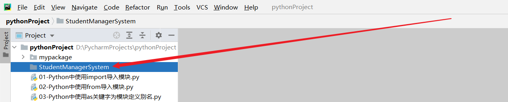
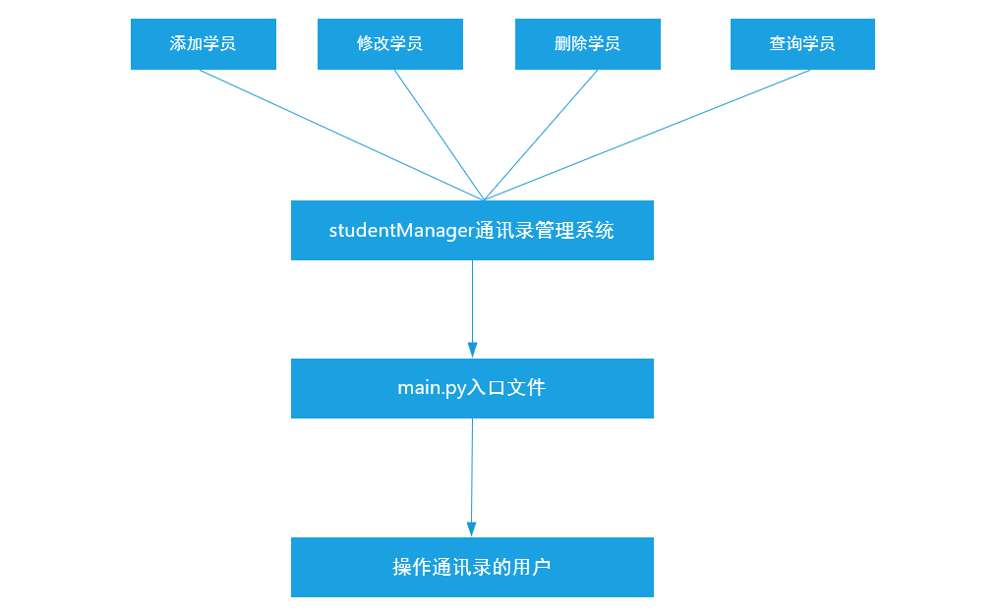

# **Python**综合案例

# 一、系统需求分析

## 1、需求分析

使用==面向对象编程思想==完成学员管理系统的开发，具体如下：

① 系统要求：==学员数据存储在文件中==

② 系统功能：==添加学员、删除学员、修改学员信息、查询学员信息、显示所有学员信息、保存学员信息及退出系统==等功能。

## 2、角色分析

在面向对象编程思想中，必须找到要具体实现操作的实体。

通过系统实现添加学员操作

通过系统实现删除学员操作

....

最终可以得出一个结论：这个通讯管理系统，其主要的实体就是==通讯录管理系统本身==


注意事项

① 为了方便维护代码，一般一个角色一个程序文件

② 项目要有主程序入口，习惯为`main.py`

## 3、创建项目



创建类文件 => studentManager.py

创建项目入口文件 => main.py



# 二、系统的代码开发

## 1、学员信息存储代码分析

students = [{}, {}, {}]

学员姓名

学员年龄

学员电话

学员信息（姓名、年龄、电话），可以使用字典来表示。但是我们已经学习了面向对象，其学员信息可以完全用对象来进行实现。

学员（主体） =>  属性（姓名、年龄、电话）

## 2、student.py类文件编写

需求：

学员信息包含：姓名、年龄、电话

添加`__str__`魔法方法，方便查看学员对象信息

```python
# 定义一个Student类
class Student():
    # 定义魔术方法，用于初始化属性信息
    def __init__(self, name, age, mobile):
        self.name = name
        self.age = age
        self.mobile = mobile
    # 定义魔术方法，用于打印输出学员信息
    def __str__(self):
        return f'{self.name}, {self.age}, {self.mobile}'
```

## 3、编写studentManager.py代码

studentManager.py

```python
class StudentManager(object):
    # 定义__init__魔术方法，用于初始化操作
    def __init__(self):
        # 定义一个列表，将来用于保存所有学员信息
        self.student_list = []
```

未来数据的存储格式如下：

```python
self.student_list = [p1, p2, p3, p4, ...]
```

## 4、学员管理系统具体功能说明

需求：

存储数据的位置：文件(student.data) 

* 加载文件数据 

* 修改数据后保存到文件

存储数据的形式：列表存储学员对象

系统功能： 

① 添加学员信息

② 删除学员信息

③ 修改学员信息

④ 查询学员信息

⑤ 显示所有学员信息

⑥ 保存学员信息

⑦ 退出系统

编写程序代码，用于实现以上的所有功能：

### ☆ 基础逻辑代码

```python
class StudentManager(object):
    # 定义一个__init__魔术方法，用于初始化数据
    def __init__(self):
        # 初始化一个student_list属性，用于将来保存所有学员对象信息
        self.student_list = []

    # 定义load_student()方法
    def load_student(self):
        pass

    # 定义静态show_help()方法
    @staticmethod
    def show_help():
        print('-' * 40)
        print('传智教育通讯录管理系统V2.0')
        print('1.添加学员信息')
        print('2.删除学员信息')
        print('3.修改学员信息')
        print('4.查询学员信息')
        print('5.显示所有学员信息')
        # V2.0新增功能
        print('6.保存学员信息')
        print('7.退出系统')
        print('-' * 40)

    def add_student(self):
        pass

    def del_student(self):
        pass

    def mod_student(self):
        pass

    def show_student(self):
        pass

    def show_all(self):
        pass

    def save_student(self):
        pass

    # 定义一个run()方法，专门用于实现对管理系统中各个功能调用
    def run(self):
        # 1、调用一个学员加载方法，用于加载文件中的所有学员信息，加载完成后，把得到的所有学员信息保存在student_list属性中
        self.load_student()
        # 2、显示帮助信息，提示用户输入要实现的功能编号
        while True:
            # 显示帮助信息
            self.show_help()
            # 提示用户输入要操作功能编号
            user_num = int(input('请输入要操作功能的编号：'))
            if user_num == 1:
                self.add_student()
            elif user_num == 2:
                self.del_student()
            elif user_num == 3:
                self.mod_student()
            elif user_num == 4:
                self.show_student()
            elif user_num == 5:
                self.show_all()
            elif user_num == 6:
                self.save_student()
            elif user_num == 7:
                print('感谢您使用传智教育通讯录管理系统V2.0，欢迎下次使用！')
                break
            else:
                print('信息输入错误，请重新输入...')
```

### ☆ main.py入口文件的编写

```python
# 从studentManager模块中导入StudentManager类功能
from studentManager import StudentManager

# 定义入口代码
if __name__ == '__main__':
    student_manager = StudentManager()
    student_manager.run()
```

### ☆ 编写add_student()学员添加方法实现

需求：用户输入学员姓名、年龄、手机号，将学员添加到系统。

步骤： 

① 用户输入姓名、年龄、手机号

② 创建该学员对象（真正添加到列表中的是对象）

③ 将该学员对象添加到列表[] => append()

```python
    from student import Student
	...    
    ...
    ...
    def add_student(self):
        # 提示用户输入学员信息
        name = input('请输入学员的姓名：')
        age = int(input('请输入学员的年龄：'))
        mobile = input('请输入学员的电话：')
        # 使用Student类实例化对象
        student = Student(name, age, mobile)
        # 调用student_list属性，追加student对象信息
        self.student_list.append(student)
        print('学员信息已添加成功')
```

### ☆ 编写del_student()学员删除方法实现

需求：用户输入目标学员姓名，如果学员存在则删除该学员。

步骤： 

① 用户输入目标学员姓名

② 遍历学员数据列表，如果用户输入的学员姓名存在则删除，否则则提示该学员不存在。

```python
	    def del_student(self):
        # 提示用户输入要删除的学员姓名
        name = input('请输入要删除的学员姓名：')
        # 对student_list属性（本质列表）进行遍历
        for i in self.student_list:
            if i.name == name:
                # 找到了要删除的学员，删除
                self.student_list.remove(i)
                print(f'学员{name}信息删除成功')
                break
        else:
            print('您要删除的学员不存在...')
```

### ☆ 编写mod_student()学员修改方法实现

```python
    def mod_student(self):
        # 提示用户输入要修改的学员姓名
        name = input('请输入要修改的学员姓名：')
        # 对student_list属性进行遍历，判断要修改的学员姓名是否存在
        for i in self.student_list:
            if i.name == name:
                i.name = input('请输入修改后的学员姓名：')
                i.age = int(input('请输入修改后的学员年龄：'))
                i.mobile = input('请输入修改后的学员电话：')
                print(f'学员信息修改成功，修改后信息如下 => 学员姓名：{i.name}，学员年龄：{i.age}，学员电话：{i.mobile}')
                break
        else:
            print('您要修改的学员信息不存在...')
```

### ☆ 编写show_student()学员查询方法实现

```python
    def show_student(self):
        # 提示用户输入要查询的学员姓名
        name = input('请输入要查询的学员姓名：')
        # 对student_list属性进行遍历
        for i in self.student_list:
            if i.name == name:
                print(i)
                break
        else:
            print('您要查找的学员信息不存在...')
```

### ☆ 编写show_all()方法查询所有学员实现

```python
    def show_all(self):
        # 直接对列表进行遍历
        for i in self.student_list:
            print(i)
```

### ☆ 编写save_student()方法学员信息保存功能实现

需求：将所有学员信息都保存到存储数据的文件。

步骤： 

① 打开文件 ② 读写文件 ③ 关闭文件

思考：

① 文件写入的数据是学员对象的内存地址吗？

答：一定不能是对象的内存地址，因为随着系统的运行，内存地址可能会随时改变。

② 文件内数据要求的数据类型是什么？答：必须是字符串，可以使用str()转换

### 扩展：把对象转换为dict字典格式 => `__dict__`

```python
class A(object):
    a = 0
    def __init__(self):
        self.b = 1

aa = A()
# 返回实例属性和值组成的字典
print(aa.__dict__)
```

案例：demo.py

```python
from student import Student

student_list = []
student = Student('Tom', 23, '10086')
student_list.append(student)

print(student.__dict__)  # {'name': 'Tom', 'age': 23, 'mobile': '10086'}
```

案例：把[对象1, 对象2, 对象3]中的所有对象都转换为字典

```python
from student import Student

student_list = []
student = Student('Tom', 23, '10086')
student_list.append(student)

student = Student('Harry', 25, '10010')
student_list.append(student)

# [student1, student2, student3, ...]
# list1 = []
# for i in student_list:
#     list1.append(i.__dict__)
# print(list1)

list1 = [i.__dict__ for i in student_list]
print(list1)
```

最终代码：

```python
	# 把self.student_list转换为字符串保存到student.data文件中
    def save_student(self):
        # 打开文件
        f = open('student.data', 'w', encoding='utf-8')
        # 把列表中的对象转换为字典
        new_list = [i.__dict__ for i in self.student_list]
        # 文件读写（写入）
        f.write(str(new_list))
        # 关闭文件
        f.close()
        # 提示用户数据已经保存成功了
        print('学员信息保存成功')
```

### ☆ 编写load_student()方法学员加载功能实现

load_student()方法的作用：在系统启动以后，运行run()方法以后，把student.data文件中保存好的学员信息 => 加载 => self.student_list列表中

student.data => 张三、李四、王五

下次重新运行系统

self.student_list = [张三, 李四, 王五]

添加赵六

self.student_list = [张三, 李四, 王五, 赵六]


需求：每次进入系统后，修改的数据是文件里面的数据

步骤： 

☆ 尝试以`"r"`模式打开学员数据文件，如果文件不存在则以`"w"`模式打开文件

* 如果文件存在则读取数据

* 读取数据 => str字符串类型 [{}, {}, {}]

* 转换数据类型为列表并转换列表内的字典i['name']为对象i.name

* 存储学员数据到学员列表self.student_list

☆ 关闭文件

```python
    # 定义load_student()方法
    def load_student(self):
        # 捕获异常
        try:
            f = open('student.data', 'r', encoding='utf-8')
        except:
            f = open('student.data', 'w', encoding='utf-8')
        else:
            # 如果文件存在，没有异常，则执行else语句
            content = f.read()
            # 把字符串转换为原数据类型[{}, {}, {}]
            data = eval(content)
            # 把列表中的所有字典 => 转换为对象
            self.student_list = [Student(i['name'], i['age'], i['mobile']) for i in data]

        finally:
            f.close()
```

